# THIẾT KẾ CƠ SỞ DỮ LIỆU (ENTITY RELATIONSHIP DIAGRAM - ERD)

Tài liệu này mô tả sơ đồ quan hệ thực thể (ERD) cho CSDL PostgreSQL của dự án Q-School AI. Cấu trúc được thiết kế để hỗ trợ lưu trữ dữ liệu dạng JSONB (của các cấu trúc linh hoạt như Rubric, Lesson Plan) và dữ liệu Vector (phục vụ RAG).

## 1. Sơ đồ Quan hệ Thực thể (ERD)

Dưới đây là sơ đồ chi tiết các bảng và mối quan hệ (Relationships) giữa chúng.

```mermaid
erDiagram
    %% ==========================================
    %% GROUP 1: SYSTEM CORE & AUTHENTICATION
    %% ==========================================
    USERS {
        uuid id PK
        string username "UNIQUE"
        string password_hash
        string email "UNIQUE"
        string role "teacher, student, admin"
        boolean is_active
        timestamp created_at
    }

    PROFILES {
        uuid user_id PK, FK
        string full_name
        string avatar_url
        string school_name
        text bio
        int points "Gamification points (Students)"
        timestamp updated_at
    }

    CLASSES {
        uuid id PK
        uuid teacher_id FK
        string name
        string grade_level
        string subject
        timestamp created_at
    }

    CLASS_STUDENTS {
        uuid class_id PK, FK
        uuid student_id PK, FK
        timestamp joined_at
    }

    %% ==========================================
    %% GROUP 2: EDTECH CORE (LESSONS, QUIZZES)
    %% ==========================================
    LESSONS {
        uuid id PK
        uuid teacher_id FK
        string title
        string subject
        string grade_level
        jsonb content "Nội dung giáo án sinh bởi AI"
        timestamp created_at
    }

    QUIZZES {
        uuid id PK
        uuid creator_id FK
        string title
        text content_source "Văn bản/Video YouTube gốc"
        timestamp created_at
    }

    QUESTIONS {
        uuid id PK
        uuid quiz_id FK
        text question_text
        text explanation "Giải thích đáp án bởi AI"
        int display_order
    }

    ANSWERS {
        uuid id PK
        uuid question_id FK
        text answer_text
        boolean is_correct
    }

    FLASHCARD_SETS {
        uuid id PK
        uuid student_id FK
        string title
        timestamp created_at
    }

    FLASHCARDS {
        uuid id PK
        uuid set_id FK
        text front_text
        text back_text
        int repetition_level "Mức độ Spaced Repetition"
        timestamp next_review_at
    }

    RUBRICS {
        uuid id PK
        uuid teacher_id FK
        string title
        jsonb criteria_matrix "Ma trận tiêu chí chấm điểm"
        timestamp created_at
    }

    %% ==========================================
    %% GROUP 3: AI WORKSPACE & STORAGE
    %% ==========================================
    CHAT_SESSIONS {
        uuid id PK
        uuid user_id FK
        string title
        string ai_persona "Raina, Tutor, Historical Figure"
        timestamp created_at
    }

    CHAT_MESSAGES {
        uuid id PK
        uuid session_id FK
        string sender_type "user, ai"
        text content
        timestamp created_at
    }

    DOCUMENTS {
        uuid id PK
        uuid uploader_id FK
        string filename
        string file_type "pdf, docx, image"
        string s3_url
        string status "pending, parsing, ready, error"
        timestamp created_at
    }

    DOCUMENT_CHUNKS {
        uuid id PK
        uuid document_id FK
        text chunk_text
        vector embedding_1536 "pgvector: AI Embeddings"
        int chunk_index
    }

    AI_TASKS {
        uuid id PK
        uuid user_id FK
        string task_type "generate_lesson, grade_essay, summarize"
        string status "pending, processing, completed, failed"
        jsonb result_payload "Dữ liệu trả về từ vLLM"
        timestamp created_at
        timestamp completed_at
    }

    %% ==========================================
    %% RELATIONSHIPS
    %% ==========================================
    
    %% Core Relationships
    USERS ||--o| PROFILES : "has"
    USERS ||--o{ CLASSES : "manages (Teacher)"
    CLASSES ||--o{ CLASS_STUDENTS : "enrolls"
    USERS ||--o{ CLASS_STUDENTS : "joins (Student)"
    
    %% EdTech Relationships
    USERS ||--o{ LESSONS : "creates"
    USERS ||--o{ QUIZZES : "creates"
    QUIZZES ||--o{ QUESTIONS : "contains"
    QUESTIONS ||--o{ ANSWERS : "has"
    
    USERS ||--o{ FLASHCARD_SETS : "owns"
    FLASHCARD_SETS ||--o{ FLASHCARDS : "contains"
    
    USERS ||--o{ RUBRICS : "creates"
    
    %% AI Workspace Relationships
    USERS ||--o{ CHAT_SESSIONS : "initiates"
    CHAT_SESSIONS ||--o{ CHAT_MESSAGES : "logs"
    
    USERS ||--o{ DOCUMENTS : "uploads"
    DOCUMENTS ||--o{ DOCUMENT_CHUNKS : "divided into"
    
    USERS ||--o{ AI_TASKS : "triggers"
```

## 2. Diễn giải Thiết kế (Design Notes)

### 2.1. Kiểu dữ liệu linh hoạt (JSONB)
- Cột `content` trong bảng `LESSONS` và `criteria_matrix` trong bảng `RUBRICS` sử dụng kiểu dữ liệu `JSONB`. Do cấu trúc giáo án hoặc tiêu chí chấm điểm sinh ra bởi AI có thể không đồng nhất giữa các môn học, `JSONB` cho phép lưu trữ và truy vấn nhanh chóng mà không cần định nghĩa bảng (table) quá phức tạp.
- Cột `result_payload` trong bảng `AI_TASKS` dùng `JSONB` để linh hoạt nhận bất kỳ dạng dữ liệu nào mà Celery Worker trả về từ vLLM (ví dụ: chuỗi text, JSON schema, array danh sách ý tưởng).

### 2.2. Hỗ trợ RAG (Vector Database trên PostgreSQL)
- Bảng `DOCUMENT_CHUNKS` sở hữu một cột rất đặc biệt: `embedding_1536`. Cột này được thiết kế dựa trên Extension **[pgvector](https://github.com/pgvector/pgvector)** của PostgreSQL.
- Khi một file PDF (sách giáo khoa) được upload lên bảng `DOCUMENTS`, hệ thống sẽ băm nhỏ nó ra, mã hóa thành các chuỗi vector (1536 chiều, chuẩn phổ biến của các mô hình Embedding hiện nay) và lưu vào bảng này.
- Khi Học sinh/Giáo viên đặt câu hỏi, AI sẽ dùng Vector Similarity Search để tìm ra các Chunk sát nghĩa nhất làm dữ liệu tham khảo (Retrieval-Augmented Generation).

### 2.3. Khóa chính (Primary Key - UUID)
- Toàn bộ các bảng trong hệ thống đều dùng `UUID` (Universally Unique Identifier) thay vì số nguyên tăng dần (Serial/Auto-increment). 
- **Lý do:** Tăng cường bảo mật (tránh người dùng đoán được ID của tài nguyên khác qua đường dẫn, ví dụ: `/quizzes/123`), đồng thời giúp phân tán dữ liệu dễ dàng hơn nếu sau này phải scale cơ sở dữ liệu.

### 2.4. Tính năng theo dõi tác vụ chạy ngầm (AI_TASKS)
- Do Q-School áp dụng kiến trúc Modular Monolith kết hợp Background Worker, bảng `AI_TASKS` là cốt lõi để theo dõi trạng thái.
- Web Client sẽ thường xuyên gọi API (Polling) hoặc nghe qua WebSocket thông qua `id` của bảng này để biết khi nào AI tạo xong giáo án hoặc chấm xong bài luận.
