# THIẾT KẾ CƠ SỞ DỮ LIỆU (ENTITY RELATIONSHIP DIAGRAM - ERD)

Tài liệu này mô tả sơ đồ quan hệ thực thể (ERD) cho CSDL PostgreSQL của dự án Q-School AI. Cấu trúc được thiết kế chuẩn Enterprise LMS, hỗ trợ Soft Delete, lưu trữ linh hoạt JSONB và Vector Search cho AI (RAG).

## 1. Sơ đồ Quan hệ Thực thể (ERD)

Dưới đây là sơ đồ chi tiết các bảng và mối quan hệ (Relationships) giữa chúng. Các bảng cốt lõi đều được tích hợp cơ chế `deleted_at` để bảo vệ dữ liệu (Soft Deletes).

```mermaid
erDiagram
    %% ==========================================
    %% GROUP 1: SYSTEM CORE & AUTHENTICATION
    %% ==========================================
    USERS {
        uuid id PK
        string username "UNIQUE"
        string password_hash
        string email "UNIQUE"
        string role "teacher, student, admin"
        boolean is_active
        timestamp created_at
        timestamp updated_at
        timestamp deleted_at "Soft Delete"
    }

    PROFILES {
        uuid user_id PK, FK
        string full_name
        string avatar_url
        string school_name
        text bio
        int points "Gamification points"
        timestamp updated_at
    }

    CLASSES {
        uuid id PK
        uuid teacher_id FK
        string name
        string grade_level
        string subject
        timestamp created_at
        timestamp updated_at
        timestamp deleted_at
    }

    CLASS_STUDENTS {
        uuid class_id PK, FK
        uuid student_id PK, FK
        timestamp joined_at
    }

    %% ==========================================
    %% GROUP 2: EDTECH CORE & ASSIGNMENTS
    %% ==========================================
    LESSONS {
        uuid id PK
        uuid teacher_id FK
        string title
        string subject
        string grade_level
        jsonb content "Nội dung giáo án sinh bởi AI"
        timestamp created_at
        timestamp updated_at
        timestamp deleted_at
    }

    QUIZZES {
        uuid id PK
        uuid creator_id FK
        string title
        text content_source "Văn bản gốc"
        timestamp created_at
        timestamp updated_at
        timestamp deleted_at
    }

    %% Bảng Giao bài: Kết nối Bài học/Bài thi với Lớp học (Giải quyết lỗi Floating Content)
    CLASS_ASSIGNMENTS {
        uuid id PK
        uuid class_id FK
        string resource_type "lesson, quiz"
        uuid resource_id "ID của Lesson hoặc Quiz"
        timestamp unlock_date "Thời gian mở bài"
        timestamp due_date "Hạn chót"
        timestamp created_at
    }

    QUESTIONS {
        uuid id PK
        uuid quiz_id FK
        text question_text
        string media_url "Ảnh/Video minh họa câu hỏi"
        text explanation "Giải thích đáp án"
        int display_order
    }

    ANSWERS {
        uuid id PK
        uuid question_id FK
        text answer_text
        string media_url "Ảnh minh họa đáp án"
        boolean is_correct
    }

    QUIZ_ATTEMPTS {
        uuid id PK
        uuid student_id FK
        uuid quiz_id FK
        float score
        timestamp started_at
        timestamp completed_at
    }

    STUDENT_ANSWERS {
        uuid id PK
        uuid attempt_id FK
        uuid question_id FK
        uuid selected_answer_id FK
        boolean is_correct
    }

    RUBRICS {
        uuid id PK
        uuid teacher_id FK
        string title
        jsonb criteria_matrix "Ma trận tiêu chí"
        timestamp created_at
        timestamp updated_at
        timestamp deleted_at
    }

    ESSAY_SUBMISSIONS {
        uuid id PK
        uuid student_id FK
        uuid teacher_id FK
        uuid rubric_id FK
        text content "Bài văn của học sinh"
        jsonb ai_feedback "Nhận xét chi tiết của AI"
        float score
        timestamp created_at
    }

    FLASHCARD_SETS {
        uuid id PK
        uuid creator_id FK
        string title
        timestamp created_at
        timestamp deleted_at
    }

    FLASHCARDS {
        uuid id PK
        uuid set_id FK
        text front_text
        text back_text
        string media_url "Ảnh minh họa"
    }

    FLASHCARD_REVIEWS {
        uuid id PK
        uuid student_id FK
        uuid flashcard_id FK
        int confidence_level "1-5"
        timestamp next_review_at
    }

    %% ==========================================
    %% GROUP 3: AI WORKSPACE & STORAGE
    %% ==========================================
    %% Bảng quản lý System Prompts động
    AI_PROMPTS {
        uuid id PK
        string persona_name "Tên nhân vật AI (Ví dụ: Raina, Tutor)"
        text system_prompt_template "Mẫu chỉ thị hệ thống"
        string version "v1.0"
        timestamp updated_at
    }

    CHAT_SESSIONS {
        uuid id PK
        uuid user_id FK
        uuid document_id FK "Context RAG (Chat với PDF)"
        string title
        string ai_persona "Tham chiếu tới AI_PROMPTS"
        timestamp created_at
    }

    CHAT_MESSAGES {
        uuid id PK
        uuid session_id FK
        string sender_type "user, ai"
        text content
        timestamp created_at
    }

    GENERATED_ASSETS {
        uuid id PK
        uuid creator_id FK
        string asset_type "email, iep, behavior_intervention, report_comment"
        jsonb input_params
        jsonb output_content
        timestamp created_at
    }

    DOCUMENTS {
        uuid id PK
        uuid uploader_id FK
        string filename
        string file_type "pdf, docx, image"
        string s3_url
        boolean is_public "Chia sẻ dùng chung toàn trường"
        string status "pending, parsing, ready, error"
        timestamp created_at
        timestamp deleted_at
    }

    DOCUMENT_CHUNKS {
        uuid id PK
        uuid document_id FK
        text chunk_text
        vector embedding_1536 "pgvector (Yêu cầu đánh Index HNSW)"
        int chunk_index
    }

    AI_TASKS {
        uuid id PK
        uuid user_id FK
        string task_type
        string status "pending, processing, completed, failed"
        jsonb result_payload
        timestamp created_at
        timestamp completed_at
    }

    %% ==========================================
    %% GROUP 4: BILLING & SUBSCRIPTIONS
    %% ==========================================
    PLANS {
        uuid id PK
        string name "Basic, Pro, Enterprise"
        string billing_cycle "monthly, yearly"
        int price
        jsonb features "Giới hạn tính năng (VD: max_chat=5)"
        boolean is_active
    }

    USER_SUBSCRIPTIONS {
        uuid id PK
        uuid user_id FK
        uuid plan_id FK
        string status "active, past_due, canceled"
        timestamp current_period_start
        timestamp current_period_end
        timestamp canceled_at
    }

    PAYMENT_TRANSACTIONS {
        uuid id PK
        uuid user_id FK
        uuid subscription_id FK
        int amount
        string currency
        string provider "stripe, vnpay"
        string provider_transaction_id
        string status "pending, success, failed"
        timestamp created_at
    }

    %% ==========================================
    %% RELATIONSHIPS
    %% ==========================================
    
    %% Core Relationships
    USERS ||--o| PROFILES : "has"
    USERS ||--o{ CLASSES : "manages (Teacher)"
    CLASSES ||--o{ CLASS_STUDENTS : "enrolls"
    USERS ||--o{ CLASS_STUDENTS : "joins (Student)"
    
    %% EdTech Relationships
    USERS ||--o{ LESSONS : "creates"
    USERS ||--o{ QUIZZES : "creates"
    
    %% Assigment Flow
    CLASSES ||--o{ CLASS_ASSIGNMENTS : "receives"
    
    QUIZZES ||--o{ QUESTIONS : "contains"
    QUESTIONS ||--o{ ANSWERS : "has"
    USERS ||--o{ RUBRICS : "creates"
    USERS ||--o{ FLASHCARD_SETS : "creates"
    FLASHCARD_SETS ||--o{ FLASHCARDS : "contains"
    
    %% Student Tracking
    USERS ||--o{ QUIZ_ATTEMPTS : "takes (Student)"
    QUIZZES ||--o{ QUIZ_ATTEMPTS : "has"
    QUIZ_ATTEMPTS ||--o{ STUDENT_ANSWERS : "contains"
    QUESTIONS ||--o{ STUDENT_ANSWERS : "references"
    ANSWERS ||--o{ STUDENT_ANSWERS : "chooses"

    USERS ||--o{ ESSAY_SUBMISSIONS : "submits (Student)"
    USERS ||--o{ ESSAY_SUBMISSIONS : "reviews (Teacher)"
    RUBRICS ||--o{ ESSAY_SUBMISSIONS : "graded by"

    USERS ||--o{ FLASHCARD_REVIEWS : "studies (Student)"
    FLASHCARDS ||--o{ FLASHCARD_REVIEWS : "is reviewed in"
    
    %% AI Workspace
    USERS ||--o{ CHAT_SESSIONS : "initiates"
    DOCUMENTS ||--o{ CHAT_SESSIONS : "provides context for"
    CHAT_SESSIONS ||--o{ CHAT_MESSAGES : "logs"
    
    USERS ||--o{ GENERATED_ASSETS : "generates"
    
    USERS ||--o{ DOCUMENTS : "uploads"
    DOCUMENTS ||--o{ DOCUMENT_CHUNKS : "divided into"
    
    USERS ||--o{ AI_TASKS : "triggers"

    %% Billing Flow
    PLANS ||--o{ USER_SUBSCRIPTIONS : "has"
    USERS ||--o{ USER_SUBSCRIPTIONS : "subscribes"
    USER_SUBSCRIPTIONS ||--o{ PAYMENT_TRANSACTIONS : "generates"
    USERS ||--o{ PAYMENT_TRANSACTIONS : "pays"
```

## 2. Diễn giải Thiết kế Nâng cao (Enterprise Level Design Notes)

### 2.1. Quản trị Phân phối Nội dung (CLASS_ASSIGNMENTS)
- Đây là "Trái tim" của hệ thống LMS. Mọi tài nguyên (Lesson, Quiz) khi sinh ra bởi giáo viên đều là "Nội dung số" (Digital Assets).
- Để học sinh thấy được tài nguyên, Giáo viên bắt buộc phải tạo một bản ghi vào bảng `CLASS_ASSIGNMENTS` để kết nối `class_id` với `resource_id`. Bảng này có cột `due_date` để quản lý hạn chót làm bài, rất phù hợp với môi trường giáo dục chuyên nghiệp.

### 2.2. Cơ chế Soft Delete và Audit Trails
- Trong giáo dục, tuyệt đối không được xóa cứng (Hard Delete) dữ liệu trong Database. Vì nếu giáo viên lỡ tay xóa một Lớp học, thì bài thi của học sinh lớp đó phải được bảo toàn.
- Toàn bộ các bảng cốt lõi (USERS, CLASSES, LESSONS, QUIZZES, RUBRICS) đều được trang bị cột `deleted_at`. Backend FastAPI sẽ tự động lọc bỏ các Record có `deleted_at != NULL` khỏi kết quả trả về, đảm bảo an toàn dữ liệu 100%.

### 2.3. Hỗ trợ Đa phương tiện và AI Context
- **Câu hỏi Đa phương tiện:** Bảng `QUESTIONS`, `ANSWERS` và `FLASHCARDS` đã được gắn cột `media_url`, sẵn sàng cho các câu hỏi hình ảnh môn Sinh Học hoặc nghe Audio môn Tiếng Anh.
- **RAG Context Session:** Bảng `CHAT_SESSIONS` được móc nối (Foreign Key) với `DOCUMENTS`. Điều này cho phép học sinh kích hoạt chế độ "Trò chuyện với file PDF", AI sẽ lấy toàn bộ lịch sử hội thoại + Vector Text của file đó để phản hồi.

### 2.4. Tính năng "Động hóa" AI Persona
- Bảng **`AI_PROMPTS`** được thiết kế để giải thoát Developer khỏi việc phải hardcode System Prompts vào Backend. Nếu Quản trị viên muốn thay đổi giọng điệu của trợ lý Raina hoặc thêm một Nhân vật Lịch sử mới, họ chỉ cần cấu hình ngay trên Web Admin, dữ liệu sẽ tự động được Frontend lấy xuống và truyền vào LLM.

### 2.5. Mô hình SaaS Billing (Thanh toán & Gói cước)
- Hệ thống hỗ trợ thương mại hóa thông qua nhóm bảng **BILLING & SUBSCRIPTIONS**.
- Học sinh/Giáo viên (`USERS`) có thể đăng ký (`USER_SUBSCRIPTIONS`) các gói cước (`PLANS`).
- Khi tích hợp cổng thanh toán (Stripe/VNPay), hệ thống sẽ lưu vết giao dịch tại bảng `PAYMENT_TRANSACTIONS` qua cơ chế Webhook. Dựa vào trạng thái gói cước (active/past_due), hệ thống sẽ tự động giới hạn tài nguyên tính toán AI (sinh lỗi HTTP 402 nếu hết hạn).
