# THIẾT KẾ CƠ SỞ DỮ LIỆU (ENTITY RELATIONSHIP DIAGRAM - ERD)

Tài liệu này mô tả sơ đồ quan hệ thực thể (ERD) cho CSDL PostgreSQL của dự án Q-School AI. Cấu trúc được thiết kế để hỗ trợ lưu trữ dữ liệu dạng JSONB (của các cấu trúc linh hoạt như Rubric, Lesson Plan) và dữ liệu Vector (phục vụ RAG).

## 1. Sơ đồ Quan hệ Thực thể (ERD)

Dưới đây là sơ đồ chi tiết các bảng và mối quan hệ (Relationships) giữa chúng.

```mermaid
erDiagram
    %% ==========================================
    %% GROUP 1: SYSTEM CORE & AUTHENTICATION
    %% ==========================================
    USERS {
        uuid id PK
        string username "UNIQUE"
        string password_hash
        string email "UNIQUE"
        string role "teacher, student, admin"
        boolean is_active
        timestamp created_at
    }

    PROFILES {
        uuid user_id PK, FK
        string full_name
        string avatar_url
        string school_name
        text bio
        int points "Gamification points (Students)"
        timestamp updated_at
    }

    CLASSES {
        uuid id PK
        uuid teacher_id FK
        string name
        string grade_level
        string subject
        timestamp created_at
    }

    CLASS_STUDENTS {
        uuid class_id PK, FK
        uuid student_id PK, FK
        timestamp joined_at
    }

    %% ==========================================
    %% GROUP 2: EDTECH CORE & STUDENT TRACKING
    %% ==========================================
    LESSONS {
        uuid id PK
        uuid teacher_id FK
        string title
        string subject
        string grade_level
        jsonb content "Nội dung giáo án sinh bởi AI"
        timestamp created_at
    }

    QUIZZES {
        uuid id PK
        uuid creator_id FK
        string title
        text content_source "Văn bản/Video gốc"
        timestamp created_at
    }

    QUESTIONS {
        uuid id PK
        uuid quiz_id FK
        text question_text
        text explanation "Giải thích đáp án bởi AI"
        int display_order
    }

    ANSWERS {
        uuid id PK
        uuid question_id FK
        text answer_text
        boolean is_correct
    }

    %% Bảng theo dõi điểm số Trắc nghiệm
    QUIZ_ATTEMPTS {
        uuid id PK
        uuid student_id FK
        uuid quiz_id FK
        float score
        timestamp started_at
        timestamp completed_at
    }

    STUDENT_ANSWERS {
        uuid id PK
        uuid attempt_id FK
        uuid question_id FK
        uuid selected_answer_id FK
        boolean is_correct
    }

    RUBRICS {
        uuid id PK
        uuid teacher_id FK
        string title
        jsonb criteria_matrix "Ma trận tiêu chí chấm điểm"
        timestamp created_at
    }

    %% Bảng nộp bài Tự luận để AI chấm
    ESSAY_SUBMISSIONS {
        uuid id PK
        uuid student_id FK
        uuid teacher_id FK
        uuid rubric_id FK
        text content "Bài văn của học sinh"
        jsonb ai_feedback "Nhận xét chi tiết của AI"
        float score
        timestamp created_at
    }

    FLASHCARD_SETS {
        uuid id PK
        uuid creator_id FK
        string title
        timestamp created_at
    }

    FLASHCARDS {
        uuid id PK
        uuid set_id FK
        text front_text
        text back_text
    }

    %% Bảng lưu tiến độ Spaced Repetition cá nhân hóa
    FLASHCARD_REVIEWS {
        uuid id PK
        uuid student_id FK
        uuid flashcard_id FK
        int confidence_level "1-5"
        timestamp next_review_at
    }

    %% ==========================================
    %% GROUP 3: AI WORKSPACE & STORAGE
    %% ==========================================
    CHAT_SESSIONS {
        uuid id PK
        uuid user_id FK
        string title
        string ai_persona "Raina, Tutor, Historical Figure"
        timestamp created_at
    }

    CHAT_MESSAGES {
        uuid id PK
        uuid session_id FK
        string sender_type "user, ai"
        text content
        timestamp created_at
    }

    %% Bảng gom chung các AI Assets nhỏ để chống rác Database
    GENERATED_ASSETS {
        uuid id PK
        uuid creator_id FK
        string asset_type "email, iep, behavior_intervention, report_comment"
        jsonb input_params "Tham số yêu cầu đầu vào"
        jsonb output_content "Văn bản AI sinh ra"
        timestamp created_at
    }

    DOCUMENTS {
        uuid id PK
        uuid uploader_id FK
        string filename
        string file_type "pdf, docx, image"
        string s3_url
        string status "pending, parsing, ready, error"
        timestamp created_at
    }

    DOCUMENT_CHUNKS {
        uuid id PK
        uuid document_id FK
        text chunk_text
        vector embedding_1536 "pgvector: AI Embeddings"
        int chunk_index
    }

    AI_TASKS {
        uuid id PK
        uuid user_id FK
        string task_type "generate_lesson, grade_essay, summarize"
        string status "pending, processing, completed, failed"
        jsonb result_payload "Dữ liệu trả về từ vLLM"
        timestamp created_at
        timestamp completed_at
    }

    %% ==========================================
    %% RELATIONSHIPS
    %% ==========================================
    
    %% Core Relationships
    USERS ||--o| PROFILES : "has"
    USERS ||--o{ CLASSES : "manages (Teacher)"
    CLASSES ||--o{ CLASS_STUDENTS : "enrolls"
    USERS ||--o{ CLASS_STUDENTS : "joins (Student)"
    
    %% EdTech Relationships (Creation)
    USERS ||--o{ LESSONS : "creates"
    USERS ||--o{ QUIZZES : "creates"
    QUIZZES ||--o{ QUESTIONS : "contains"
    QUESTIONS ||--o{ ANSWERS : "has"
    USERS ||--o{ RUBRICS : "creates"
    USERS ||--o{ FLASHCARD_SETS : "creates"
    FLASHCARD_SETS ||--o{ FLASHCARDS : "contains"
    
    %% Student Tracking Relationships
    USERS ||--o{ QUIZ_ATTEMPTS : "takes (Student)"
    QUIZZES ||--o{ QUIZ_ATTEMPTS : "has"
    QUIZ_ATTEMPTS ||--o{ STUDENT_ANSWERS : "contains"
    QUESTIONS ||--o{ STUDENT_ANSWERS : "references"
    ANSWERS ||--o{ STUDENT_ANSWERS : "chooses"

    USERS ||--o{ ESSAY_SUBMISSIONS : "submits (Student)"
    USERS ||--o{ ESSAY_SUBMISSIONS : "reviews (Teacher)"
    RUBRICS ||--o{ ESSAY_SUBMISSIONS : "graded by"

    USERS ||--o{ FLASHCARD_REVIEWS : "studies (Student)"
    FLASHCARDS ||--o{ FLASHCARD_REVIEWS : "is reviewed in"
    
    %% AI Workspace Relationships
    USERS ||--o{ CHAT_SESSIONS : "initiates"
    CHAT_SESSIONS ||--o{ CHAT_MESSAGES : "logs"
    
    USERS ||--o{ GENERATED_ASSETS : "generates"
    
    USERS ||--o{ DOCUMENTS : "uploads"
    DOCUMENTS ||--o{ DOCUMENT_CHUNKS : "divided into"
    
    USERS ||--o{ AI_TASKS : "triggers"
```

## 2. Diễn giải Thiết kế Cập nhật (Design Notes)

### 2.1. Giải quyết Lỗ hổng Tracking Học Sinh
- **`QUIZ_ATTEMPTS` & `STUDENT_ANSWERS`:** Cho phép giáo viên theo dõi điểm số, đồng thời học sinh xem lại lịch sử làm bài và giải thích đáp án sai.
- **`ESSAY_SUBMISSIONS`:** Gắn kết vòng lặp: Học sinh nộp bài -> Giáo viên chọn Rubric -> AI chấm -> Trả `ai_feedback` về cho học sinh.

### 2.2. Gom nhóm Tài sản AI (Polymorphic-like Storage)
- Bảng **`GENERATED_ASSETS`** là một "phễu" chứa toàn bộ các văn bản sinh ra từ các công cụ tiện ích (UC-FT-009 đến 013) như: Email, Kế hoạch IEP, Phương pháp can thiệp hành vi.
- Bằng cách sử dụng cột `asset_type` (Phân loại) và `output_content` (Dạng JSONB), hệ thống tránh được tình trạng rác Database (Database Bloat) do phải tạo hàng chục bảng nhỏ lẻ.

### 2.3. Hỗ trợ Spaced Repetition (Lặp lại ngắt quãng)
- Thuật toán ôn tập Flashcard (Ví dụ: Thuật toán SuperMemo) cần biết học sinh đánh giá độ khó của thẻ như thế nào (1-5 sao) để tính ngày ôn tập tiếp theo.
- Bảng **`FLASHCARD_REVIEWS`** tách rời tiến độ của từng `student_id` với `flashcard_id` gốc, cho phép nhiều học sinh dùng chung một bộ Flashcard của trường mà không bị ghi đè tiến trình học tập lên nhau.

### 2.4. Kiểu dữ liệu linh hoạt (JSONB) & Vector
- Các cột `content`, `criteria_matrix`, `result_payload` tiếp tục dùng `JSONB`.
- Bảng `DOCUMENT_CHUNKS` sử dụng kiểu dữ liệu `vector(1536)` từ **pgvector** để tìm kiếm ngữ nghĩa siêu tốc (Semantic Search) phục vụ RAG.

### 2.5. Khóa chính (Primary Key - UUID)
- Toàn bộ bảng dùng `UUID` làm ID. Ngăn chặn triệt để hành vi ID-Guessing (Ví dụ: Học sinh tự gõ URL `submissions/100` để xem bài của bạn khác).
