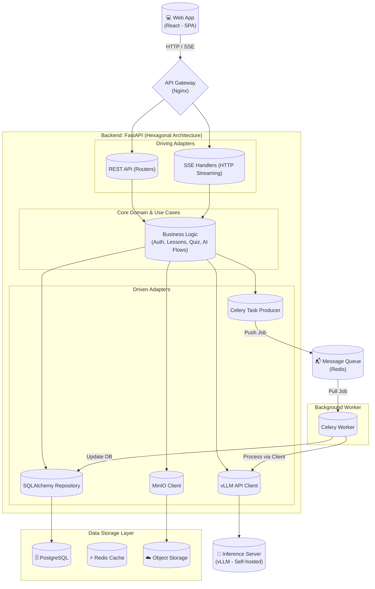

# KIẾN TRÚC HỆ THỐNG TỔNG THỂ (HIGH-LEVEL SYSTEM ARCHITECTURE)

Tài liệu này mô tả kiến trúc tổng thể của nền tảng **Q-School AI**, được thiết kế theo mô hình **Modular Monolith** kết hợp **Kiến trúc Lục giác (Hexagonal Architecture)**. Hệ thống sử dụng FastAPI làm lõi xử lý và giao tiếp với máy chủ suy luận LLM cục bộ (self-hosted).

## 1. Mục tiêu kiến trúc (Architectural Goals)
Do Q-School là một hệ thống EdTech có tích hợp Trí tuệ nhân tạo (AI-native), kiến trúc cần đáp ứng các tiêu chí cốt lõi:
- **Tách biệt cốt lõi nghiệp vụ (Isolation of Domain):** Áp dụng Hexagonal Architecture để logic nghiệp vụ (Core Domain) không bị phụ thuộc vào framework (FastAPI) hay công nghệ Database (PostgreSQL).
- **Xử lý bất đồng bộ (Asynchronous Processing):** Các tác vụ AI như sinh giáo án, chấm bài tự luận đòi hỏi thời gian xử lý dài. Hệ thống sử dụng Message Queue để không chặn (block) luồng trải nghiệm của người dùng.
- **Bảo mật dữ liệu (Data Privacy):** Tự host Mô hình ngôn ngữ (Self-hosted vLLM) giúp toàn bộ dữ liệu học thuật và học sinh được giữ kín hoàn toàn trên server nội bộ, không phụ thuộc vào bên thứ ba (như OpenAI).

## 2. Các thành phần chính (System Components)

### 2.1. Client Layer (Lớp người dùng)
- **Công nghệ cốt lõi:** **React** (Single Page Application).
- **Web App:** Dành cho Giáo viên (Quản trị, tạo bài giảng, chấm điểm) và Học sinh (Làm Quiz, Chat AI, Flashcard).

### 2.2. API Gateway & Load Balancer
- Điểm tiếp nhận duy nhất cho mọi request từ React App (Reverse Proxy).
- **Chức năng:** Định tuyến request (Routing), Giới hạn tốc độ (Rate Limiting), và Xử lý SSL/TLS.
- *Tech stack:* Nginx.

### 2.3. Application Layer (Backend - FastAPI Hexagonal Architecture)
Backend được xây dựng bằng **FastAPI (Python)**. Toàn bộ logic được chia theo mô hình Hexagonal (Ports & Adapters):
- **Driving Adapters (Primary):**
  - Các Restful API Endpoints (FastAPI Routers) tiếp nhận request HTTP.
  - Server-Sent Events (SSE) để trả kết quả AI theo thời gian thực (streaming).
- **Core Domain & Use Cases:**
  - Chứa toàn bộ logic nghiệp vụ thuần túy (Các file Use Case Nhóm 0 đến Nhóm 5).
  - Định nghĩa các Ports (Interfaces) để giao tiếp với bên ngoài.
- **Driven Adapters (Secondary):**
  - Data Repositories: Tương tác với PostgreSQL (qua SQLAlchemy).
  - External Services: HTTP Client để gọi vLLM server, kết nối S3 để tải file.

### 2.4. Message Queue & Background Workers
- Khi người dùng gọi một tác vụ AI (VD: Chấm bài văn), FastAPI sẽ đẩy công việc này vào Hàng đợi (Queue) và trả về phản hồi "Đang xử lý".
- Worker (Celery/RQ) sẽ lấy công việc ra xử lý ngầm, gọi tới server vLLM, và cập nhật kết quả vào CSDL.
- *Tech stack:* Redis + Celery / RQ.

### 2.5. AI Inference Server (Máy chủ suy luận AI)
- Thay vì gọi API ra ngoài, hệ thống dùng một máy chủ chuyên dụng (GPU Server) chạy **vLLM**.
- vLLM sẽ host các mô hình mã nguồn mở (VD: Qwen, LLaMA) và cung cấp API chuẩn (OpenAI-compatible) cho Backend FastAPI gọi tới. Tối ưu hóa cực tốt cho tốc độ và bộ nhớ VRAM.

### 2.6. Data Layer (Lớp Dữ liệu)
- **Relational Database:** **PostgreSQL** (Lưu trữ User, Lớp, Học bạ, Cấu trúc bài tập, và Dữ liệu Thanh toán SaaS).
- **Cache / Session DB:** **Redis** (Lưu trữ phiên đăng nhập, Token, và Caching kết quả).
- **Vector Database:** Tích hợp trực tiếp **pgvector** trên PostgreSQL (Lưu trữ Embeddings để AI tra cứu tài liệu qua RAG, tối ưu tài nguyên thay vì dùng database rời).
- **Object Storage:** **Cloudflare R2 / MinIO / AWS S3** (Chứa file PDF, ảnh, video. Khuyên dùng Cloudflare R2 vì miễn phí băng thông Egress).

### 2.7. Payment Gateway Integration (Cổng thanh toán SaaS)
- Hệ thống tích hợp trực tiếp với các cổng thanh toán (Stripe, VNPay, MoMo) qua cơ chế **Webhooks**.
- Các gói cước (Plans) giới hạn mức sử dụng (Rate Limit) cho tài nguyên AI. Hệ thống tự động khóa tính năng nếu hết hạn gói.

---

## 3. Biểu đồ Kiến trúc (Architecture Diagram)

## 4. Các luồng xử lý điển hình (Typical Data Flows)

### 4.1. Luồng xử lý Đồng bộ (Synchronous Flow)
*(Ví dụ: Xem danh sách học sinh - UC-SYS-004)*
1. **React App** gửi request GET `/api/students`.
2. **API Gateway** định tuyến đến **FastAPI REST Router** (Driving Adapter).
3. Router gọi **Use Case (Core Domain)**, xác thực quyền truy cập.
4. Use Case gọi **Repository (Driven Adapter)** để truy vấn **PostgreSQL**.
5. Dữ liệu được trả về và mapping thành JSON response gửi lại React.

### 4.2. Luồng xử lý AI Bất đồng bộ (Async AI Flow)
*(Ví dụ: Nhờ AI Tutor sinh câu hỏi - UC-FS-001)*
1. Học sinh nhấn nút "Gửi câu hỏi". React gửi POST `/api/ai-tutor/ask`.
2. **FastAPI Router** nhận request, gọi **Use Case**.
3. **Use Case** thông qua **Queue Adapter** đẩy thông điệp vào **Redis Queue** và lập tức trả về HTTP 202 Accepted cho React.
4. **Celery Worker** lấy thông điệp từ Queue.
5. Worker gọi **vLLM Adapter** để gửi prompt tới **vLLM Server**.
6. Sau khi vLLM Server sinh câu trả lời (Inference), Worker lưu lịch sử chat vào **PostgreSQL**.
7. Thông qua cơ chế **Server-Sent Events (SSE)**, FastAPI nhận kết quả và đẩy luồng chữ trực tiếp về giao diện React.
