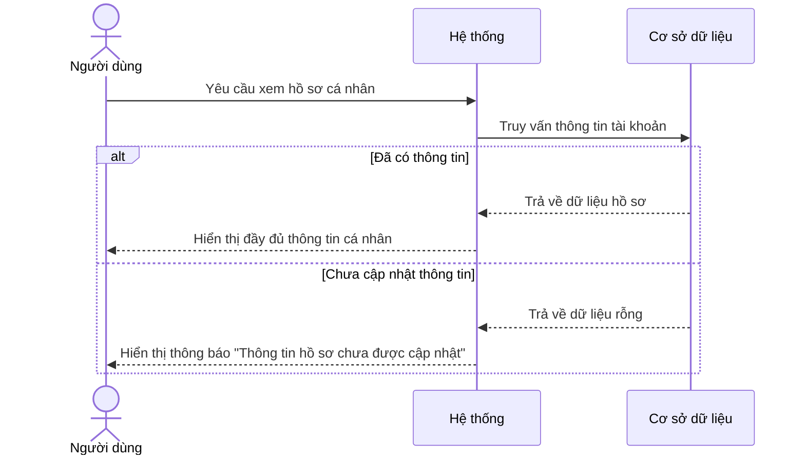

# NHÓM 0: SYSTEM CORE (HỆ THỐNG CỐT LÕI)

**Actor (Người dùng):** Tất cả người dùng (Giáo viên, Học sinh, Quản lý)

## 1. UC-SYS-001: Xem hồ sơ cá nhân (View Profile)
* **Tình huống:** Người dùng muốn kiểm tra lại thông tin cá nhân, email liên hệ hoặc lịch sử hoạt động trên hệ thống.
* **Mô tả ngắn:** Use-case này cho phép người dùng xem thông tin hồ sơ cá nhân của mình. Sau khi đăng nhập thành công, người dùng có thể truy cập vào trang hồ sơ để xem các thông tin cá nhân như tên, email, thông tin liên hệ và lịch sử hoạt động.
* **Kết quả dự kiến:** Hệ thống hiển thị chính xác và đầy đủ các thông tin cá nhân của tài khoản đang đăng nhập.
* **Luồng cơ bản:**
  | Hành động của tác nhân | Phản ứng của hệ thống | Dữ liệu |
  | :--- | :--- | :--- |
  | 1. Người dùng yêu cầu xem hồ sơ cá nhân. | 2. Hệ thống tải dữ liệu và hiển thị giao diện hồ sơ cá nhân. | - Thông tin hồ sơ |
  | 3. Người dùng xem các thông tin cá nhân. | 4. Hệ thống hiển thị đầy đủ thông tin của người dùng. | |
* **Luồng ngoại lệ:** 
  - **Không có thông tin hồ sơ:** Nếu người dùng chưa hoàn thành việc nhập thông tin hồ sơ, hệ thống hiển thị thông báo "Thông tin hồ sơ chưa được cập nhật".
* **Yêu cầu đặc biệt:** Không có.
* **Tiền điều kiện:** Người dùng đã đăng nhập vào hệ thống.
* **Điều kiện sau:** Người dùng có thể xem tất cả các thông tin trong hồ sơ cá nhân của mình mà không thay đổi được chúng.
* **Điểm mở rộng:** Liên kết đến Use-case "Chỉnh sửa hồ sơ cá nhân" nếu người dùng muốn cập nhật thông tin.

### Biểu đồ tuần tự (Sequence Diagram)

