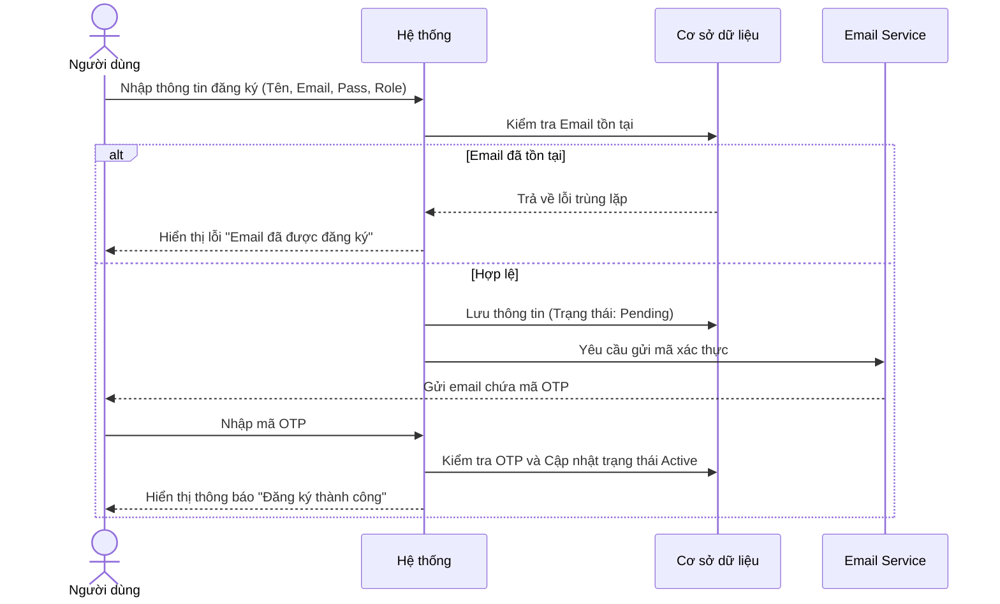
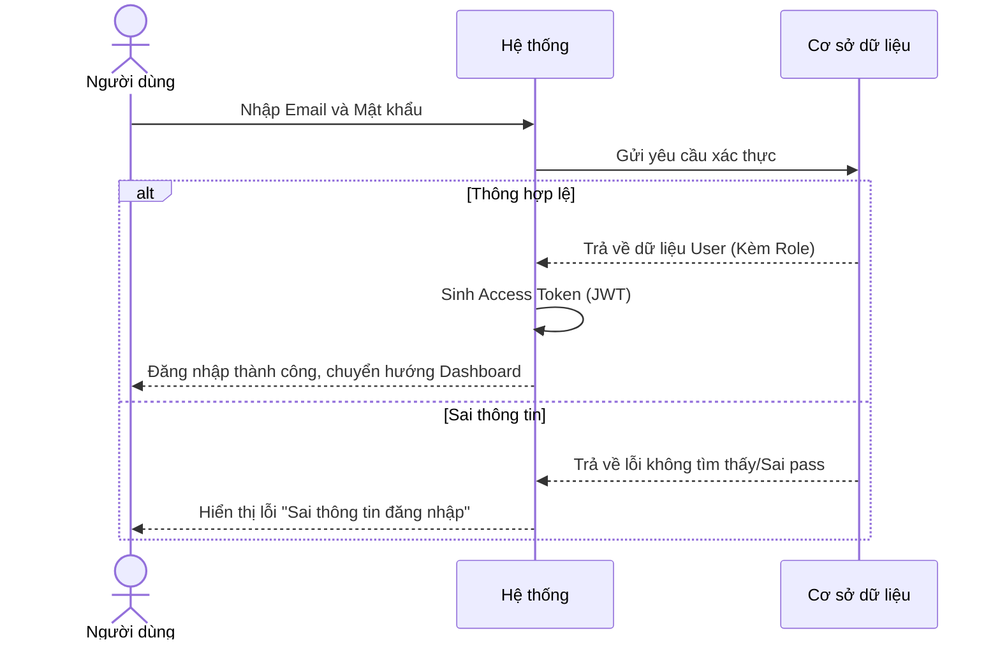
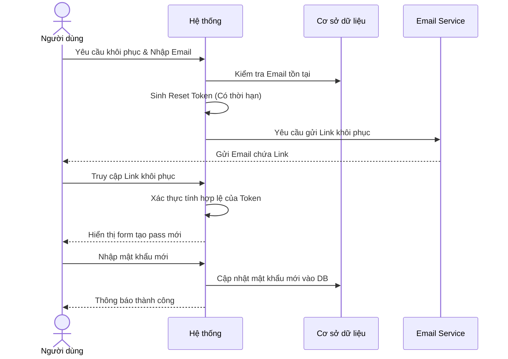
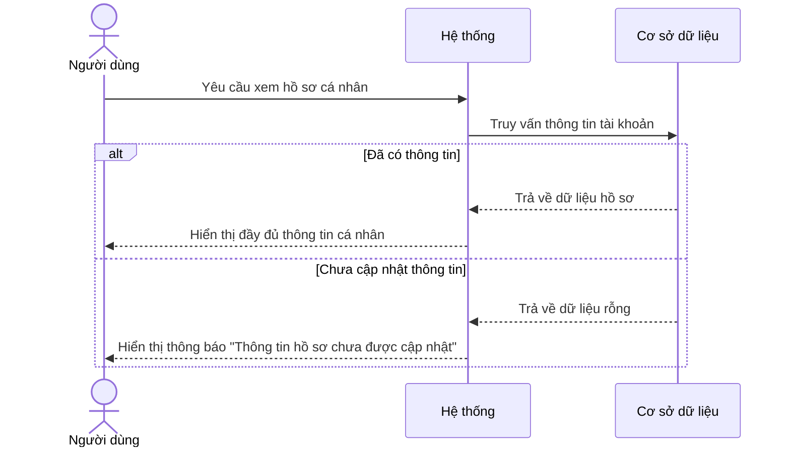

# NHÓM 0: SYSTEM CORE (HỆ THỐNG CỐT LÕI)

**Actor (Người dùng):** Tất cả người dùng (Giáo viên, Học sinh, Quản lý)

## 1. UC-SYS-001: Đăng ký tài khoản (Register)
* **Tình huống:** Người dùng mới lần đầu truy cập hệ thống và cần tạo tài khoản để sử dụng các tính năng giáo dục.
* **Mô tả ngắn:** Use-case này cho phép người dùng đăng ký tài khoản mới bằng cách cung cấp các thông tin cơ bản (Họ tên, Email, Mật khẩu, Chọn vai trò: Giáo viên/Học sinh).
* **Kết quả dự kiến:** Một tài khoản mới được tạo thành công trên hệ thống và người dùng có thể đăng nhập.
* **Luồng cơ bản:**
  | Hành động của tác nhân | Phản ứng của hệ thống | Dữ liệu |
  | :--- | :--- | :--- |
  | Người dùng chọn "Đăng ký" và điền thông tin (Họ tên, Email, Mật khẩu, Role). | Hệ thống tiếp nhận và kiểm tra tính hợp lệ của dữ liệu định dạng. | - Tên, Email, Mật khẩu, Role* |
  | Người dùng bấm "Xác nhận đăng ký". | Hệ thống kiểm tra Email trùng lặp, tạo tài khoản tạm và gửi mã xác thực (OTP/Link) qua Email. | - Mã xác thực |
  | Người dùng nhập mã xác thực từ Email. | Hệ thống xác minh mã, kích hoạt tài khoản và thông báo thành công. | - Token/Trạng thái Active |
* **Luồng ngoại lệ:** 
  - **Email đã tồn tại:** Hệ thống thông báo "Email này đã được đăng ký" và yêu cầu đăng nhập hoặc sử dụng email khác.
  - **Mã xác thực hết hạn/Sai:** Hệ thống báo lỗi và cho phép yêu cầu gửi lại mã.
* **Yêu cầu đặc biệt:** Mật khẩu phải đạt chuẩn bảo mật (ít nhất 8 ký tự, có chữ và số).
* **Tiền điều kiện:** Người dùng chưa có tài khoản tương ứng với Email.
* **Điều kiện sau:** Tài khoản được lưu trữ an toàn trong DB và ở trạng thái Active.

### Biểu đồ tuần tự (Sequence Diagram)

## 2. UC-SYS-002: Đăng nhập hệ thống (Login)
* **Tình huống:** Người dùng truy cập hệ thống và cần xác thực danh tính để vào trang làm việc (Dashboard).
* **Mô tả ngắn:** Use-case cho phép người dùng đã có tài khoản nhập thông tin xác thực để truy cập vào hệ thống với quyền hạn tương ứng.
* **Kết quả dự kiến:** Người dùng được chuyển hướng vào Dashboard với đúng các tính năng dành cho Role của mình.
* **Luồng cơ bản:**
  | Hành động của tác nhân | Phản ứng của hệ thống | Dữ liệu |
  | :--- | :--- | :--- |
  | Người dùng nhập Email và Mật khẩu, bấm "Đăng nhập". | Hệ thống mã hóa mật khẩu, đối chiếu CSDL. Sau đó sinh Access Token, phân quyền và chuyển hướng. | - Email, Mật khẩu* - Access Token - Role |
* **Luồng ngoại lệ:** 
  - **Sai thông tin:** Nếu sai Email hoặc Mật khẩu, hệ thống báo "Tên đăng nhập hoặc mật khẩu không chính xác".
  - **Tài khoản bị khóa:** Hệ thống thông báo "Tài khoản của bạn đã bị khóa, vui lòng liên hệ Admin".
* **Yêu cầu đặc biệt:** Có cơ chế chống Spam (nhập sai quá 5 lần sẽ khóa tạm thời 15 phút).
* **Tiền điều kiện:** Người dùng đã có tài khoản Active trên hệ thống.
* **Điều kiện sau:** Phiên làm việc (Session) được khởi tạo thành công.

### Biểu đồ tuần tự (Sequence Diagram)

## 3. UC-SYS-003: Quên mật khẩu (Forgot Password)
* **Tình huống:** Người dùng không nhớ mật khẩu đăng nhập của mình và cần thiết lập lại.
* **Mô tả ngắn:** Cung cấp cơ chế gửi liên kết (link) khôi phục mật khẩu qua Email đã đăng ký để người dùng tạo mật khẩu mới một cách bảo mật.
* **Kết quả dự kiến:** Người dùng thiết lập được mật khẩu mới và đăng nhập thành công.
* **Luồng cơ bản:**
  | Hành động của tác nhân | Phản ứng của hệ thống | Dữ liệu |
  | :--- | :--- | :--- |
  | Người dùng chọn "Quên mật khẩu" và nhập Email. | Hệ thống kiểm tra Email, sinh Reset Token và gửi link qua Email Service. | - Email* - Reset Token |
  | Người dùng truy cập Link từ Email. | Hệ thống xác thực Token và hiển thị giao diện nhập mật khẩu mới. | |
  | Người dùng nhập mật khẩu mới và xác nhận. | Hệ thống mã hóa, cập nhật mật khẩu vào DB và thông báo thành công. | - Mật khẩu mới* |
* **Luồng ngoại lệ:** 
  - **Email không tồn tại:** Để bảo mật, hệ thống vẫn hiển thị "Nếu email tồn tại, một link khôi phục đã được gửi" để chống dò rỉ tài khoản.
  - **Link hết hạn:** Nếu link quá 24h, hệ thống báo "Link khôi phục đã hết hạn".
* **Yêu cầu đặc biệt:** Reset Token chỉ dùng được 1 lần và có thời hạn.
* **Tiền điều kiện:** Người dùng không thể đăng nhập được do quên mật khẩu.
* **Điều kiện sau:** Mật khẩu mới được cập nhật, mật khẩu cũ bị vô hiệu hóa.

### Biểu đồ tuần tự (Sequence Diagram)

## 4. UC-SYS-004: Xem hồ sơ cá nhân (View Profile)
* **Tình huống:** Người dùng muốn kiểm tra lại thông tin cá nhân, email liên hệ hoặc lịch sử hoạt động trên hệ thống.
* **Mô tả ngắn:** Use-case này cho phép người dùng xem thông tin hồ sơ cá nhân của mình. Sau khi đăng nhập thành công, người dùng có thể truy cập vào trang hồ sơ để xem các thông tin cá nhân như tên, email, thông tin liên hệ và lịch sử hoạt động.
* **Kết quả dự kiến:** Hệ thống hiển thị chính xác và đầy đủ các thông tin cá nhân của tài khoản đang đăng nhập.
* **Luồng cơ bản:**
  | Hành động của tác nhân | Phản ứng của hệ thống | Dữ liệu |
  | :--- | :--- | :--- |
  | Người dùng yêu cầu xem hồ sơ cá nhân. | Hệ thống tải dữ liệu và hiển thị đầy đủ thông tin hồ sơ. | - Thông tin hồ sơ |
* **Luồng ngoại lệ:** 
  - **Không có thông tin hồ sơ:** Nếu người dùng chưa hoàn thành việc nhập thông tin hồ sơ, hệ thống hiển thị thông báo "Thông tin hồ sơ chưa được cập nhật".
* **Yêu cầu đặc biệt:** Không có.
* **Tiền điều kiện:** Người dùng đã đăng nhập vào hệ thống.
* **Điều kiện sau:** Người dùng có thể xem tất cả các thông tin trong hồ sơ cá nhân của mình mà không thay đổi được chúng.
* **Điểm mở rộng:** Liên kết đến Use-case "Chỉnh sửa hồ sơ cá nhân" nếu người dùng muốn cập nhật thông tin.

### Biểu đồ tuần tự (Sequence Diagram)

