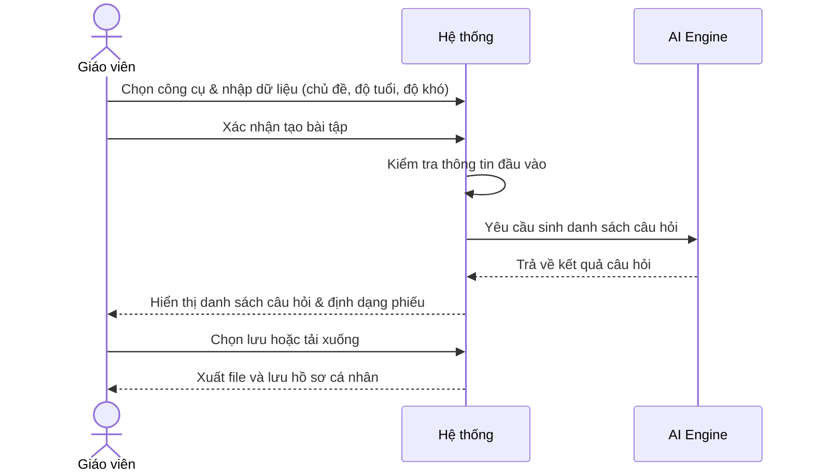
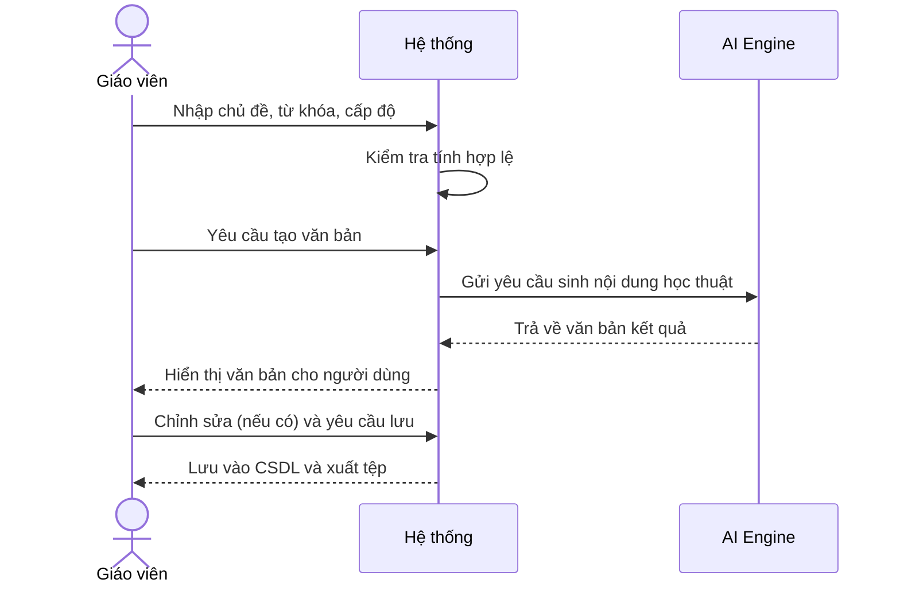
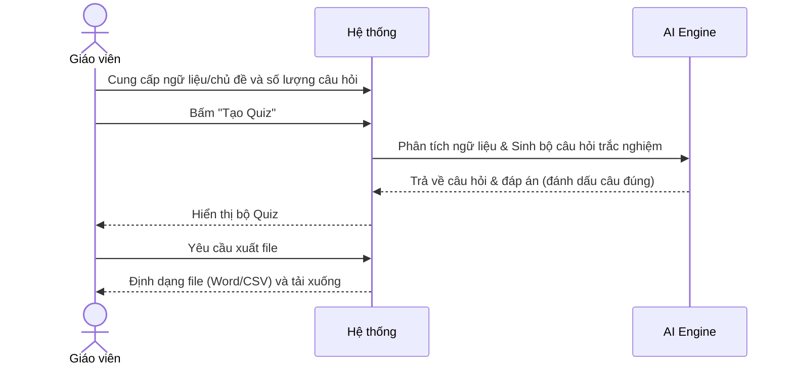
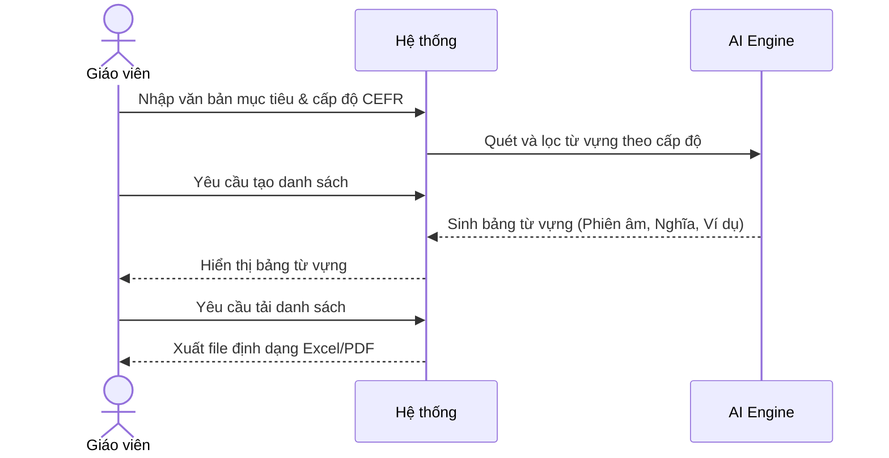

# NHÓM 1: SOẠN GIẢNG & TẠO NỘI DUNG

**Actor (Người dùng):** Giáo viên (Teacher)

## 1. UC-FT-003: Tạo bài tập thực hành (Worksheet Generator)
* **Tình huống:** Giáo viên cần chuẩn bị bài tập về nhà hoặc phiếu bài tập trên lớp cho học sinh sau khi dạy xong một lý thuyết mới.
* **Mô tả ngắn:** Use-case này cho phép người dùng (Giáo viên) tạo tự động các phiếu bài tập thực hành dựa trên chủ đề, độ tuổi và yêu cầu môn học.
* **Kết quả dự kiến:** Một tệp/phiếu bài tập hoàn chỉnh phù hợp với độ tuổi và chủ đề môn học.
* **Luồng cơ bản:**
  | Hành động của tác nhân | Phản ứng của hệ thống | Dữ liệu |
  | :--- | :--- | :--- |
  | 1. Người dùng chọn công cụ Tạo bài tập thực hành. | 2. Hệ thống hiển thị giao diện cấu hình phiếu bài tập. | - Loại công cụ |
  | 3. Người dùng nhập chủ đề, chọn khối lớp và độ khó. | 4. Hệ thống tiếp nhận và kiểm tra thông tin đầu vào. | - Chủ đề* - Độ tuổi* - Mức độ khó (* Dữ liệu bắt buộc) |
  | 5. Người dùng xác nhận tạo bài tập. | 6. Hệ thống xử lý AI và sinh ra danh sách câu hỏi kèm định dạng phiếu. | - Nội dung câu hỏi |
  | 7. Người dùng chọn lưu hoặc tải xuống. | 8. Hệ thống xuất file (PDF/Word) và lưu vào hồ sơ cá nhân. | - Tệp bài tập |
* **Luồng ngoại lệ:** Thiếu thông tin bắt buộc: Nếu tại bước 3 người dùng không nhập chủ đề, hệ thống sẽ hiển thị cảnh báo yêu cầu bổ sung.
* **Yêu cầu đặc biệt:** Ngôn từ và khối lượng kiến thức phải phù hợp chuẩn sư phạm của độ tuổi đã chọn.
* **Tiền điều kiện:** Người dùng đã đăng nhập vào hệ thống với vai trò Giáo viên.
* **Điều kiện sau:** Phiếu bài tập được tạo thành công và sẵn sàng in ấn hoặc giao cho học sinh.
* **Điểm mở rộng:** Không có.

### Biểu đồ tuần tự (Sequence Diagram)

## 2. UC-FT-004: Tạo nội dung học thuật (Academic Content Generator)
* **Tình huống:** Giáo viên cần tài liệu đọc thêm, văn bản mẫu hoặc tóm tắt lý thuyết để bổ sung vào giáo trình.
* **Mô tả ngắn:** Giáo viên sử dụng công cụ để tạo các đoạn văn bản, tài liệu đọc thêm hoặc lý thuyết chuyên sâu phù hợp với trình độ học sinh.
* **Kết quả dự kiến:** Một đoạn văn bản học thuật chuẩn xác, đúng ngữ pháp và mức độ đọc hiểu của học sinh.
* **Luồng cơ bản:**
  | Hành động của tác nhân | Phản ứng của hệ thống | Dữ liệu |
  | :--- | :--- | :--- |
  | 1. Người dùng chọn công cụ và nhập chủ đề, từ khóa, cấp độ học sinh. | 2. Hệ thống kiểm tra tính hợp lệ của các thông tin đầu vào. | - Chủ đề* - Cấp độ* - Độ dài mong muốn |
  | 3. Người dùng yêu cầu tạo văn bản. | 4. Hệ thống AI xử lý và sinh ra nội dung học thuật tương ứng. | - Văn bản kết quả |
  | 5. Người dùng chỉnh sửa (nếu cần) và chọn lưu. | 6. Hệ thống cập nhật bản lưu vào cơ sở dữ liệu cá nhân của người dùng. | - Tệp văn bản (.docx/.pdf) |
* **Luồng ngoại lệ:** Thiếu từ khóa/chủ đề: Hệ thống báo đỏ ô nhập liệu và yêu cầu bổ sung.
* **Yêu cầu đặc biệt:** Văn phong phải chuẩn mực, cung cấp thông tin chính xác, khách quan.
* **Tiền điều kiện:** Người dùng đăng nhập với vai trò Giáo viên.
* **Điều kiện sau:** Có văn bản học thuật hoàn chỉnh để đưa vào giáo án.
* **Điểm mở rộng:** Không có.

### Biểu đồ tuần tự (Sequence Diagram)

## 3. UC-FT-005: Tạo bài kiểm tra trắc nghiệm (Multiple Choice Quiz)
* **Tình huống:** Giáo viên muốn tổ chức kiểm tra bài cũ đầu giờ (15 phút) hoặc bài thi giữa kỳ môn học.
* **Mô tả ngắn:** Tự động tạo bộ câu hỏi trắc nghiệm nhiều lựa chọn kèm đáp án dựa trên đoạn văn bản hoặc chủ đề được cung cấp.
* **Kết quả dự kiến:** Bộ câu hỏi trắc nghiệm kèm theo đáp án và giải thích chi tiết.
* **Luồng cơ bản:**
  | Hành động của tác nhân | Phản ứng của hệ thống | Dữ liệu |
  | :--- | :--- | :--- |
  | 1. Người dùng dán văn bản gốc hoặc nhập chủ đề, chọn số lượng câu hỏi. | 2. Hệ thống tiếp nhận và phân tích ngữ liệu gốc. | - Ngữ liệu/Chủ đề* - Số lượng câu* |
  | 3. Người dùng bấm "Tạo Quiz". | 4. Hệ thống sinh ra danh sách câu hỏi, 4 đáp án (A,B,C,D) và đánh dấu đáp án đúng. | - Bộ câu hỏi & đáp án |
  | 5. Người dùng xuất file hoặc đưa lên nền tảng thi trực tuyến. | 6. Hệ thống định dạng file xuất (Word/CSV) phù hợp. | - Tệp trắc nghiệm |
* **Luồng ngoại lệ:** Ngữ liệu quá ngắn: Hệ thống thông báo không đủ dữ kiện để tạo đủ số lượng câu hỏi yêu cầu.
* **Yêu cầu đặc biệt:** Đảm bảo có duy nhất 1 đáp án đúng cho mỗi câu, các đáp án gây nhiễu (distractors) phải hợp lý.
* **Tiền điều kiện:** Người dùng đăng nhập với vai trò Giáo viên.
* **Điều kiện sau:** Có tệp Quiz sẵn sàng để học sinh làm bài.
* **Điểm mở rộng:** Tích hợp trực tiếp lên các nền tảng như Kahoot, Quizizz.

### Biểu đồ tuần tự (Sequence Diagram)

## 4. UC-FT-006: Tạo danh sách từ vựng (Vocabulary List Generator)
* **Tình huống:** Giáo viên ngoại ngữ hoặc môn chuyên ngành cần cung cấp các từ vựng cốt lõi trước khi học sinh đọc một đoạn văn bản khó.
* **Mô tả ngắn:** Hệ thống trích xuất và định nghĩa các từ vựng quan trọng từ một văn bản để học sinh chuẩn bị trước khi đọc hiểu.
* **Kết quả dự kiến:** Danh sách từ vựng kèm nghĩa, loại từ và câu ví dụ minh họa.
* **Luồng cơ bản:**
  | Hành động của tác nhân | Phản ứng của hệ thống | Dữ liệu |
  | :--- | :--- | :--- |
  | 1. Người dùng cung cấp văn bản mục tiêu và chọn cấp độ CEFR mong muốn. | 2. Hệ thống quét văn bản và lọc các từ vựng theo cấp độ đã chọn. | - Văn bản gốc* - Cấp độ từ vựng* |
  | 3. Người dùng yêu cầu tạo danh sách. | 4. Hệ thống trả về bảng từ vựng gồm: Từ, Loại từ, Phiên âm, Nghĩa, Câu ví dụ. | - Bảng từ vựng |
  | 5. Người dùng tải danh sách về. | 6. Hệ thống xuất file định dạng bảng (Excel/PDF). | - Tệp từ vựng |
* **Luồng ngoại lệ:** Văn bản không chứa từ vựng ở cấp độ đã chọn: Hệ thống thông báo và gợi ý hạ/tăng cấp độ.
* **Yêu cầu đặc biệt:** Cung cấp câu ví dụ phải bám sát ngữ cảnh của văn bản gốc.
* **Tiền điều kiện:** Người dùng đăng nhập với vai trò Giáo viên.
* **Điều kiện sau:** Giáo viên có danh sách từ vựng chuẩn bị cho bài giảng.
* **Điểm mở rộng:** Không có.

### Biểu đồ tuần tự (Sequence Diagram)

