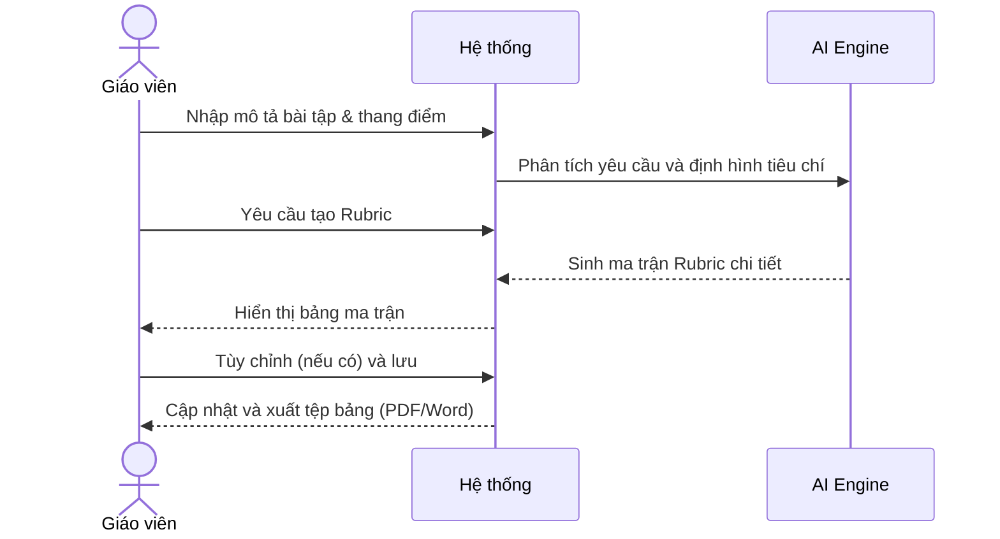
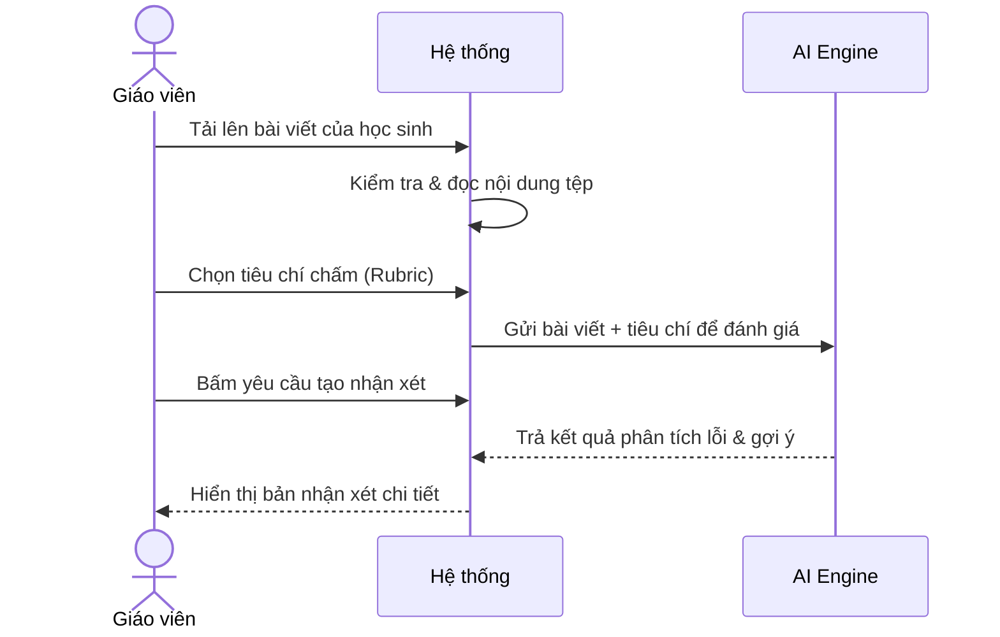
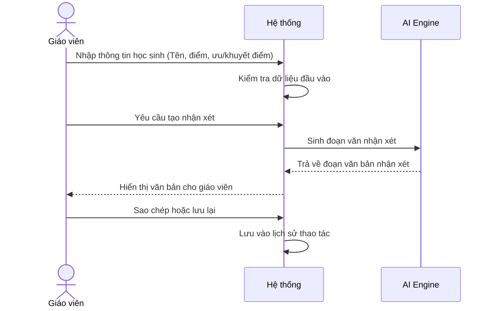
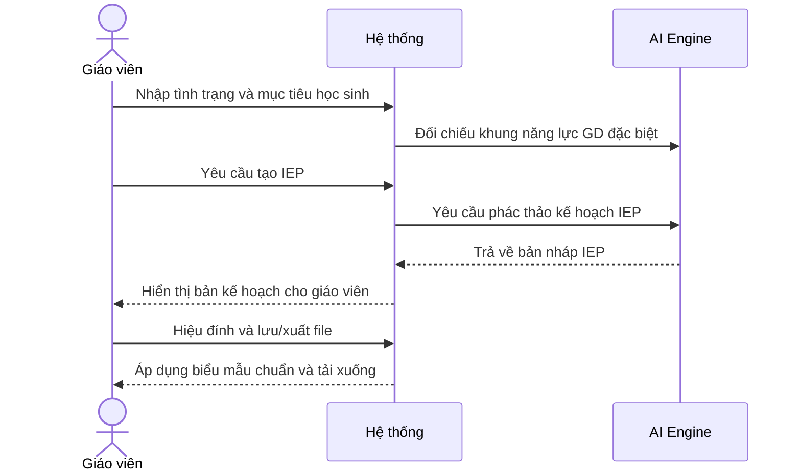

# NHÓM 2: ASSESSMENT & FEEDBACK (ĐÁNH GIÁ & PHẢN HỒI)

**Actor (Người dùng):** Giáo viên (Teacher)

## 1. UC-FT-007: Tạo thang điểm đánh giá (Rubric Generator)
* **Tình huống:** Giáo viên giao một bài tiểu luận hoặc dự án nhóm và cần công bố các tiêu chí chấm điểm minh bạch cho học sinh.
* **Mô tả ngắn:** Tạo bảng tiêu chí chấm điểm (Rubric) chi tiết cho các bài tập dự án, thuyết trình hoặc tự luận.
* **Kết quả dự kiến:** Bảng Rubric chi tiết phân chia theo từng tiêu chí (Nội dung, Trình bày, Sáng tạo...) và mức điểm.
* **Luồng cơ bản:**
  | Hành động của tác nhân | Phản ứng của hệ thống | Dữ liệu |
  | :--- | :--- | :--- |
  | 1. Người dùng nhập tên bài tập, mục tiêu học tập và thang điểm (VD: 1-4, 1-10). | 2. Hệ thống phân tích yêu cầu để lên các tiêu chí thành phần (Nội dung, Hình thức...). | - Mô tả bài tập* - Thang điểm* |
  | 3. Người dùng yêu cầu tạo Rubric. | 4. Hệ thống sinh ra bảng ma trận gồm các tiêu chí và mô tả chi tiết cho từng mức điểm. | - Ma trận Rubric |
  | 5. Người dùng tùy chỉnh text và bấm lưu. | 6. Hệ thống cập nhật thay đổi và xuất tệp dạng bảng. | - Tệp Rubric (PDF/Word) |
* **Luồng ngoại lệ:** Không có.
* **Yêu cầu đặc biệt:** Lời văn mô tả tiêu chí ở mỗi mức điểm phải rõ ràng, có tính định lượng và dễ phân biệt.
* **Tiền điều kiện:** Người dùng đăng nhập với vai trò Giáo viên.
* **Điều kiện sau:** Có bảng Rubric chuẩn để công bố cho học sinh.
* **Điểm mở rộng:** Dùng làm đầu vào cho UC-FT-008 (Writing Feedback).

### Biểu đồ tuần tự (Sequence Diagram)

## 2. UC-FT-008: Chấm và phản hồi bài viết (Writing Feedback)
* **Tình huống:** Giáo viên thu hàng chục bài luận của học sinh và cần đưa ra nhận xét chi tiết để học sinh cải thiện lỗi sai.
* **Mô tả ngắn:** Use-case này cho phép Giáo viên tải lên bài viết của học sinh để hệ thống AI phân tích lỗi và đưa ra nhận xét chi tiết.
* **Kết quả dự kiến:** Bản nhận xét chỉ ra lỗi ngữ pháp, cấu trúc câu và gợi ý cách viết tốt hơn.
* **Luồng cơ bản:**
  | Hành động của tác nhân | Phản ứng của hệ thống | Dữ liệu |
  | :--- | :--- | :--- |
  | 1. Người dùng tải văn bản/bài viết của học sinh lên. | 2. Hệ thống đọc và phân tích nội dung văn bản. | - Tệp văn bản* |
  | 3. Người dùng chọn tiêu chí chấm điểm (Rubric). | 4. Hệ thống ghi nhận tiêu chí và bắt đầu đánh giá. | - Tiêu chí đánh giá |
  | 5. Người dùng yêu cầu tạo nhận xét. | 6. Hệ thống trả về bảng đánh giá lỗi ngữ pháp, cấu trúc và gợi ý sửa. | - Kết quả phản hồi |
* **Luồng ngoại lệ:** Tệp không hợp lệ: Nếu văn bản mờ, lỗi font hoặc quá dung lượng, hệ thống báo lỗi và yêu cầu tải lại.
* **Yêu cầu đặc biệt:** Phản hồi phải mang tính xây dựng (constructive feedback), không dùng từ ngữ gây nản chí.
* **Tiền điều kiện:** Người dùng đã đăng nhập vào hệ thống.
* **Điều kiện sau:** Bản nhận xét được tạo ra để giáo viên gửi trực tiếp cho học sinh.
* **Điểm mở rộng:** Liên kết đến Use-case "Tạo thang điểm đánh giá (Rubric Generator)" nếu người dùng chưa có tiêu chí.

### Biểu đồ tuần tự (Sequence Diagram)

## 3. UC-FT-009: Tạo nhận xét sổ liên lạc (Report Card Comments)
* **Tình huống:** Cuối học kỳ, giáo viên chủ nhiệm phải viết nhận xét cá nhân hóa cho từng học sinh gửi về gia đình.
* **Mô tả ngắn:** Tạo các đoạn nhận xét cá nhân hóa về năng lực và thái độ học tập của từng học sinh để gửi phụ huynh.
* **Kết quả dự kiến:** Các đoạn nhận xét mang tính xây dựng, chuyên nghiệp dựa trên điểm số và thái độ học tập của học sinh.
* **Luồng cơ bản:**
  | Hành động của tác nhân | Phản ứng của hệ thống | Dữ liệu |
  | :--- | :--- | :--- |
  | 1. Người dùng nhập thông tin: Tên học sinh, điểm mạnh, điểm yếu, điểm số. | 2. Hệ thống kiểm tra dữ liệu đầu vào. | - Tên, Giới tính* - Đặc điểm học tập* |
  | 3. Người dùng yêu cầu tạo nhận xét. | 4. Hệ thống sinh ra đoạn văn nhận xét mượt mà, chuyên nghiệp mang tính khích lệ. | - Văn bản nhận xét |
  | 5. Người dùng copy hoặc lưu lại. | 6. Hệ thống lưu lịch sử thao tác. | - Lịch sử nhận xét |
* **Luồng ngoại lệ:** Không có.
* **Yêu cầu đặc biệt:** Văn phong lịch sự, quy tắc "bánh mì kẹp thịt" (Khen - Góp ý - Khích lệ).
* **Tiền điều kiện:** Người dùng đăng nhập với vai trò Giáo viên.
* **Điều kiện sau:** Hoàn thành nhận xét cho học sinh.
* **Điểm mở rộng:** Không có.

### Biểu đồ tuần tự (Sequence Diagram)

## 4. UC-FT-010: Tạo kế hoạch giáo dục cá nhân (IEP Generator)
* **Tình huống:** Giáo viên tiếp nhận học sinh có nhu cầu giáo dục đặc biệt và cần lên lộ trình học tập riêng.
* **Mô tả ngắn:** Phác thảo Kế hoạch Giáo dục Cá nhân (IEP) cho học sinh cần hỗ trợ đặc biệt.
* **Kết quả dự kiến:** Bản phác thảo mục tiêu, phương pháp can thiệp và đánh giá dành riêng cho học sinh đó.
* **Luồng cơ bản:**
  | Hành động của tác nhân | Phản ứng của hệ thống | Dữ liệu |
  | :--- | :--- | :--- |
  | 1. Người dùng nhập tình trạng hiện tại của học sinh và các mục tiêu mong muốn. | 2. Hệ thống đối chiếu dữ liệu với các khung năng lực giáo dục đặc biệt. | - Tình trạng học sinh* - Mục tiêu dự kiến* |
  | 3. Người dùng bấm tạo IEP. | 4. Hệ thống sinh bản kế hoạch gồm: Mục tiêu ngắn/dài hạn, phương pháp hỗ trợ, cách đo lường. | - Bản nháp IEP |
  | 5. Người dùng hiệu đính và xuất file. | 6. Hệ thống định dạng theo biểu mẫu chuẩn của trường học. | - Tệp hồ sơ IEP |
* **Luồng ngoại lệ:** Không có.
* **Yêu cầu đặc biệt:** Đảm bảo tính bảo mật và dùng từ ngữ chuyên môn tâm lý/giáo dục phù hợp.
* **Tiền điều kiện:** Người dùng đăng nhập với vai trò Giáo viên.
* **Điều kiện sau:** Có bản phác thảo IEP để họp với phụ huynh và Ban giám hiệu.
* **Điểm mở rộng:** Không có.

### Biểu đồ tuần tự (Sequence Diagram)

