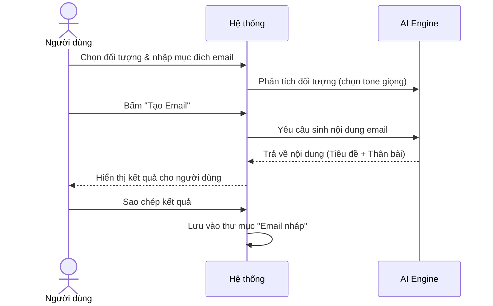
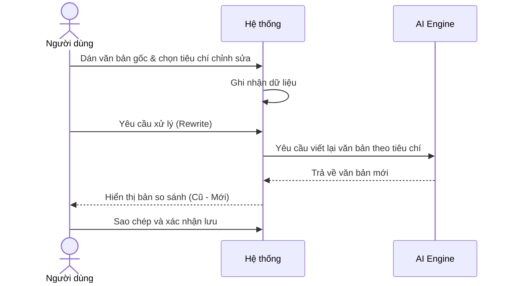
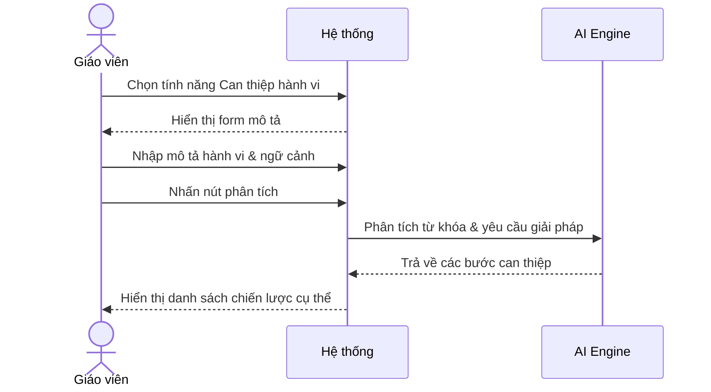
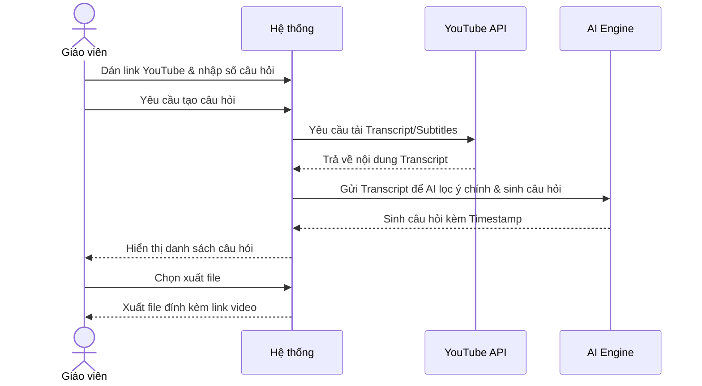

# NHÓM 3: COMMUNICATION & ADMIN (GIAO TIẾP & QUẢN LÝ)

**Actor (Người dùng):** Giáo viên / Quản lý trường học (Teacher/Admin)

## 1. UC-FT-011: Soạn email chuyên nghiệp (Professional Email)
* **Tình huống:** Giáo viên cần gửi email thông báo kỷ luật, xin lỗi phụ huynh hoặc đề xuất ý kiến với Ban giám hiệu.
* **Mô tả ngắn:** Viết nhanh các email giao tiếp học đường (gửi phụ huynh, ban giám hiệu) với giọng văn chuẩn mực.
* **Kết quả dự kiến:** Một email với văn phong lịch sự, chuyên nghiệp và rõ ràng mục đích.
* **Luồng cơ bản:**
  | Hành động của tác nhân | Phản ứng của hệ thống | Dữ liệu |
  | :--- | :--- | :--- |
  | 1. Người dùng chọn đối tượng nhận và ghi tóm tắt nội dung/mục đích email. | 2. Hệ thống phân tích đối tượng để chọn sắc thái (tone) phù hợp. | - Người nhận* - Mục đích* |
  | 3. Người dùng bấm "Tạo Email". | 4. Hệ thống sinh ra nội dung email hoàn chỉnh bao gồm cả tiêu đề (Subject). | - Nội dung Email |
  | 5. Người dùng sao chép để gửi. | 6. Hệ thống lưu trữ vào mục "Email nháp". | - Bản lưu nháp |
* **Luồng ngoại lệ:** Không có.
* **Yêu cầu đặc biệt:** Không sinh ra nội dung cam kết sai sự thật hoặc mang tính pháp lý bừa bãi.
* **Tiền điều kiện:** Người dùng đăng nhập với vai trò Giáo viên/Quản lý.
* **Điều kiện sau:** Có nội dung email sẵn sàng để gửi.
* **Điểm mở rộng:** Không có.

### Biểu đồ tuần tự (Sequence Diagram)

## 2. UC-FT-012: Điều chỉnh văn phong tài liệu (Text Rewriter)
* **Tình huống:** Giáo viên có một tài liệu chuyên ngành quá phức tạp và muốn viết lại cho học sinh tiểu học dễ hiểu hơn.
* **Mô tả ngắn:** Điều chỉnh lại văn phong, độ khó hoặc tóm tắt một đoạn văn bản có sẵn để phù hợp với đối tượng người đọc.
* **Kết quả dự kiến:** Đoạn văn bản mới giữ nguyên ý chính nhưng thay đổi từ vựng và cấu trúc câu phù hợp đối tượng.
* **Luồng cơ bản:**
  | Hành động của tác nhân | Phản ứng của hệ thống | Dữ liệu |
  | :--- | :--- | :--- |
  | 1. Người dùng dán văn bản gốc và chọn yêu cầu (Đơn giản hóa, mở rộng, chuyên nghiệp hơn). | 2. Hệ thống đọc hiểu văn bản gốc và ghi nhận yêu cầu chỉnh sửa. | - Văn bản gốc* - Tiêu chí viết lại* |
  | 3. Người dùng yêu cầu xử lý. | 4. Hệ thống viết lại văn bản, giữ nguyên ý chính nhưng thay đổi cấu trúc/từ vựng. | - Văn bản mới |
  | 5. Người dùng xác nhận lưu. | 6. Hệ thống hiển thị bản so sánh (nếu cần) và cho phép copy. | - Kết quả Text |
* **Luồng ngoại lệ:** Đoạn văn gốc quá ngắn hoặc vô nghĩa: Hệ thống báo lỗi không thể phân tích.
* **Yêu cầu đặc biệt:** Phải bảo toàn thông tin cốt lõi (fact-checking) của văn bản gốc.
* **Tiền điều kiện:** Người dùng đã đăng nhập.
* **Điều kiện sau:** Có đoạn văn bản mới đúng mục đích.
* **Điểm mở rộng:** Không có.

### Biểu đồ tuần tự (Sequence Diagram)

## 3. UC-FT-013: Tìm kiếm giải pháp can thiệp hành vi (Behavior Intervention)
* **Tình huống:** Học sinh liên tục mất tập trung hoặc gây gổ trong lớp, giáo viên không biết nên xử lý thế nào cho khéo léo.
* **Mô tả ngắn:** Use-case này hỗ trợ Giáo viên tìm các chiến lược và giải pháp sư phạm để xử lý các vấn đề hành vi đặc thù của học sinh trong lớp.
* **Kết quả dự kiến:** Danh sách các chiến lược tâm lý và hành động cụ thể để điều chỉnh hành vi học sinh.
* **Luồng cơ bản:**
  | Hành động của tác nhân | Phản ứng của hệ thống | Dữ liệu |
  | :--- | :--- | :--- |
  | 1. Người dùng chọn chức năng Can thiệp hành vi. | 2. Hệ thống hiển thị form yêu cầu mô tả tình huống. | - Yêu cầu tác vụ |
  | 3. Người dùng mô tả hành vi của học sinh và ngữ cảnh. | 4. Hệ thống phân tích từ khóa hành vi. | - Mô tả hành vi* - Ngữ cảnh |
  | 5. Người dùng nhấn nút phân tích. | 6. Hệ thống đưa ra danh sách các bước can thiệp tâm lý và hành động cụ thể. | - Danh sách giải pháp |
* **Luồng ngoại lệ:** Không có.
* **Yêu cầu đặc biệt:** Phương pháp can thiệp tuân thủ các nguyên tắc tâm lý học học đường.
* **Tiền điều kiện:** Người dùng đã đăng nhập với vai trò Giáo viên.
* **Điều kiện sau:** Cung cấp được giải pháp thực tiễn để giáo viên áp dụng.
* **Điểm mở rộng:** Không có.

### Biểu đồ tuần tự (Sequence Diagram)

## 4. UC-FT-014: Tạo câu hỏi từ video YouTube (YouTube Video Questions)
* **Tình huống:** Giáo viên cho học sinh xem một video tài liệu trên YouTube và muốn kiểm tra xem học sinh có nắm được thông tin không.
* **Mô tả ngắn:** Trích xuất tự động các câu hỏi kiểm tra từ nội dung của một đường link YouTube giáo dục.
* **Kết quả dự kiến:** Bộ câu hỏi thảo luận bám sát nội dung và mốc thời gian (timestamp) của video.
* **Luồng cơ bản:**
  | Hành động của tác nhân | Phản ứng của hệ thống | Dữ liệu |
  | :--- | :--- | :--- |
  | 1. Người dùng dán link YouTube và chọn số lượng câu hỏi mong muốn. | 2. Hệ thống tải phụ đề (transcript) của video để phân tích nội dung. | - Link YouTube* - Số lượng câu hỏi* |
  | 3. Người dùng yêu cầu tạo. | 4. Hệ thống lọc ý chính và tạo câu hỏi kèm mốc thời gian (timestamp) tương ứng. | - Câu hỏi & Timestamp |
  | 5. Người dùng xuất danh sách. | 6. Hệ thống tạo file tài liệu đính kèm link video. | - Tệp câu hỏi |
* **Luồng ngoại lệ:** Video không có phụ đề (CC) hoặc giới hạn quyền: Hệ thống thông báo không thể trích xuất nội dung.
* **Yêu cầu đặc biệt:** Chỉ hỗ trợ các video công khai có âm thanh rõ ràng hoặc phụ đề.
* **Tiền điều kiện:** Đăng nhập với vai trò Giáo viên.
* **Điều kiện sau:** Bộ câu hỏi sẵn sàng cho hoạt động trong lớp.
* **Điểm mở rộng:** Không có.

### Biểu đồ tuần tự (Sequence Diagram)

