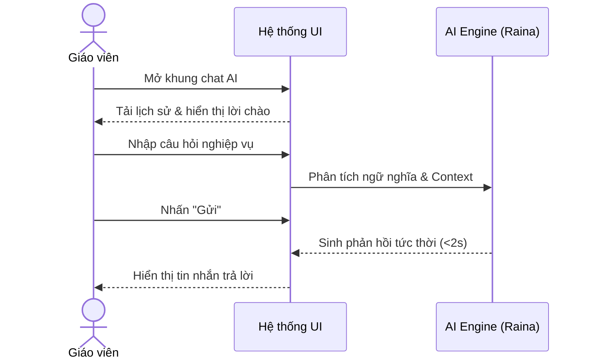
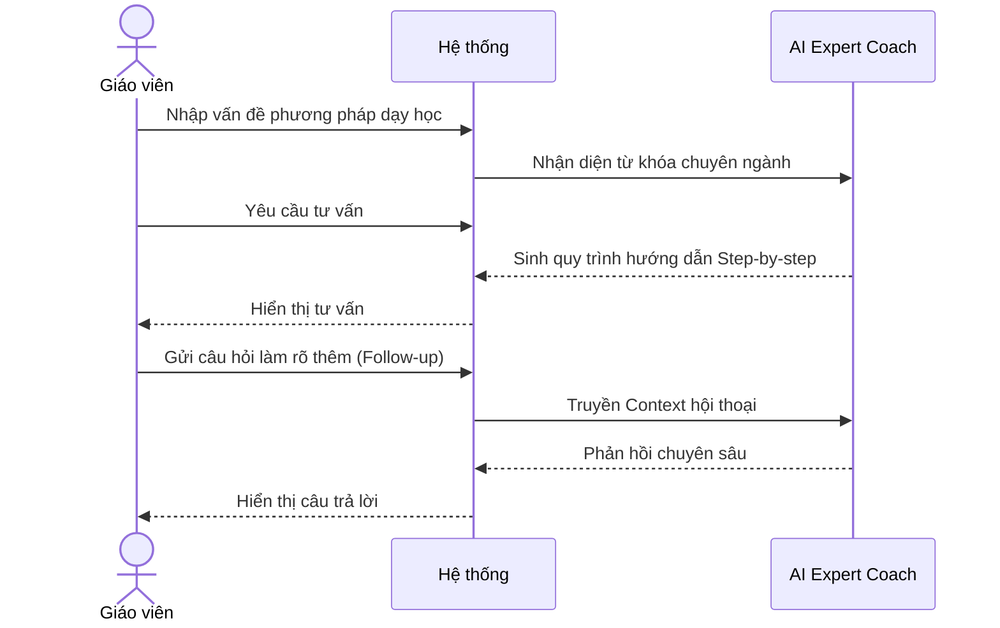
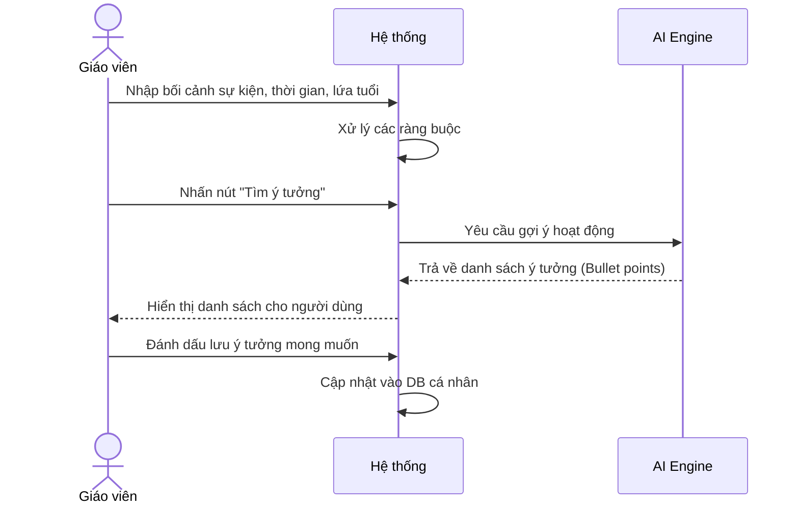

# NHÓM 4: AI ASSISTANT (TRỢ LÝ AI CHO GIÁO VIÊN)

**Actor (Người dùng):** Giáo viên (Teacher)

## 1. UC-FT-015: Trao đổi với Trợ lý sư phạm (Raina AI Chatbot)
* **Tình huống:** Giáo viên gặp thắc mắc nhanh trong quá trình soạn bài hoặc cần tra cứu gấp một kiến thức.
* **Mô tả ngắn:** Use-case này cho phép Giáo viên giao tiếp trực tiếp qua khung chat với AI để giải đáp các câu hỏi nhanh về kiến thức hoặc nghiệp vụ sư phạm.
* **Kết quả dự kiến:** Cuộc hội thoại hỏi-đáp trực tiếp giải quyết tức thời vấn đề.
* **Luồng cơ bản:**
  | Hành động của tác nhân | Phản ứng của hệ thống | Dữ liệu |
  | :--- | :--- | :--- |
  | 1. Người dùng mở khung chat với Raina. | 2. Hệ thống tải lịch sử trò chuyện và hiển thị lời chào. | - Lịch sử chat |
  | 3. Người dùng nhập câu hỏi hoặc yêu cầu. | 4. Hệ thống tiếp nhận và phân tích ngữ nghĩa câu hỏi. | - Câu hỏi dạng văn bản* |
  | 5. Người dùng gửi tin nhắn. | 6. Hệ thống phản hồi lại bằng câu trả lời tương tác. | - Nội dung phản hồi |
* **Luồng ngoại lệ:** Lỗi kết nối: Hệ thống thông báo không thể phản hồi và yêu cầu thử lại sau.
* **Yêu cầu đặc biệt:** Tốc độ phản hồi dưới 2 giây.
* **Tiền điều kiện:** Người dùng đã đăng nhập vào hệ thống.
* **Điều kiện sau:** Câu hỏi được giải đáp và lưu vào lịch sử trò chuyện.
* **Điểm mở rộng:** Không có.

### Biểu đồ tuần tự (Sequence Diagram)

## 2. UC-FT-016: Hướng dẫn phương pháp giảng dạy (AI Instructional Coach)
* **Tình huống:** Giáo viên mới ra trường cần lời khuyên về cách quản lý lớp học hoặc áp dụng phương pháp dạy học mới (ví dụ: Flipped Classroom).
* **Mô tả ngắn:** Cung cấp tư vấn chuyên sâu về phương pháp sư phạm, cách quản lý lớp học và xử lý tình huống sư phạm giả định.
* **Kết quả dự kiến:** Các hướng dẫn từng bước, mang tính chuyên môn cao về kỹ năng sư phạm.
* **Luồng cơ bản:**
  | Hành động của tác nhân | Phản ứng của hệ thống | Dữ liệu |
  | :--- | :--- | :--- |
  | 1. Người dùng nhập vấn đề sư phạm đang gặp phải (VD: Cách áp dụng Flipped Classroom). | 2. Hệ thống phân tích từ khóa chuyên ngành sư phạm. | - Vấn đề/Câu hỏi* |
  | 3. Người dùng yêu cầu tư vấn. | 4. Hệ thống đưa ra câu trả lời theo từng bước (Step-by-step) dựa trên lý thuyết giáo dục chuẩn. | - Nội dung tư vấn |
  | 5. Người dùng chat tiếp để làm rõ. | 6. Hệ thống duy trì ngữ cảnh và trả lời sâu hơn. | - Lịch sử hội thoại |
* **Luồng ngoại lệ:** Không có.
* **Yêu cầu đặc biệt:** Câu trả lời dựa trên các cơ sở khoa học giáo dục thực chứng (evidence-based).
* **Tiền điều kiện:** Đăng nhập với vai trò Giáo viên.
* **Điều kiện sau:** Người dùng nắm được phương pháp để áp dụng vào thực tế.
* **Điểm mở rộng:** Không có.

### Biểu đồ tuần tự (Sequence Diagram)

## 3. UC-FT-017: Tạo ý tưởng sáng tạo (Idea Generator)
* **Tình huống:** Giáo viên "bí" ý tưởng tổ chức trò chơi warm-up đầu giờ hoặc hoạt động ngoại khóa dịp lễ.
* **Mô tả ngắn:** Gợi ý các ý tưởng cho hoạt động ngoại khóa, trò chơi khởi động (warm-up) hoặc trang trí lớp học.
* **Kết quả dự kiến:** Danh sách các ý tưởng mới lạ, độc đáo kèm theo cách thức tổ chức.
* **Luồng cơ bản:**
  | Hành động của tác nhân | Phản ứng của hệ thống | Dữ liệu |
  | :--- | :--- | :--- |
  | 1. Người dùng nhập bối cảnh (VD: Lễ Halloween lớp 1, thời gian 15 phút). | 2. Hệ thống đánh giá các ràng buộc về thời gian, lứa tuổi. | - Bối cảnh/Sự kiện* - Yêu cầu cụ thể |
  | 3. Người dùng bấm tìm ý tưởng. | 4. Hệ thống sinh ra danh sách (bullet points) các ý tưởng khả thi, kèm cách thực hiện. | - Danh sách ý tưởng |
  | 5. Người dùng lưu ý tưởng thích hợp. | 6. Hệ thống cập nhật vào thư mục ý tưởng cá nhân. | - Dữ liệu đã lưu |
* **Luồng ngoại lệ:** Không có.
* **Yêu cầu đặc biệt:** Ưu tiên các ý tưởng dễ thực hiện, ít chi phí, an toàn cho học sinh.
* **Tiền điều kiện:** Đăng nhập với vai trò Giáo viên.
* **Điều kiện sau:** Giáo viên có kế hoạch để tổ chức hoạt động.
* **Điểm mở rộng:** Không có.

### Biểu đồ tuần tự (Sequence Diagram)

