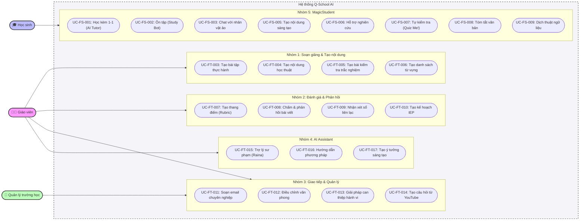

# Biểu đồ Use-case Tổng Quát (Overall Use-case Diagram)

Dưới đây là biểu đồ mô tả tổng quát các luồng tương tác giữa các Tác nhân (Actors) và Hệ thống (Q-School System), được chia thành 5 nhóm tính năng chính.

