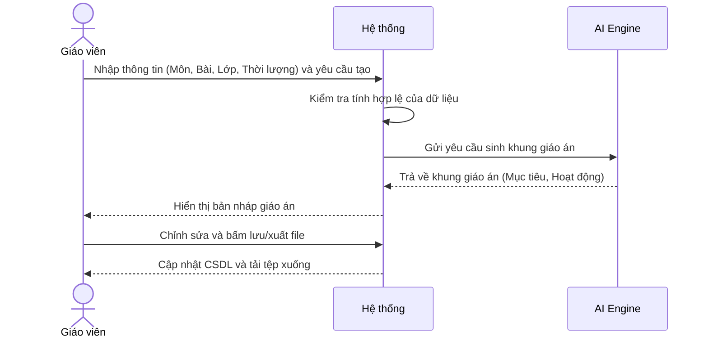
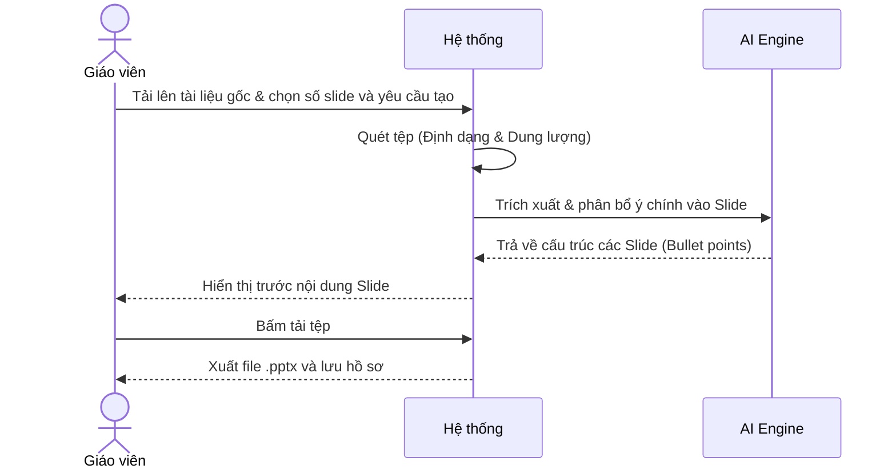
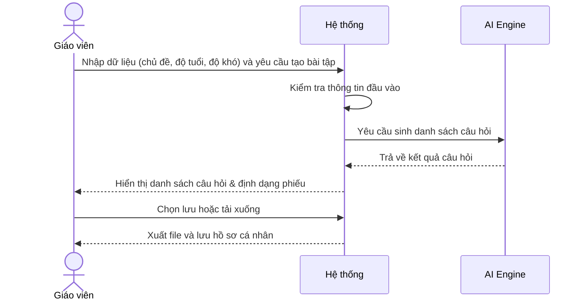
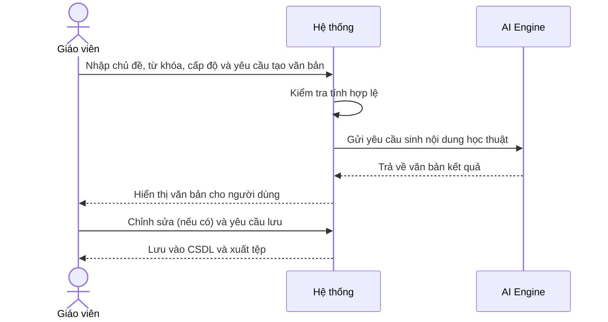
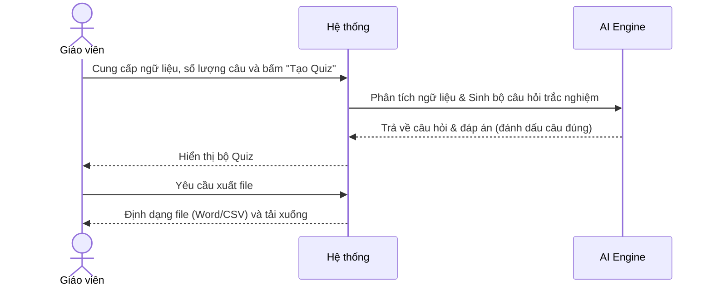
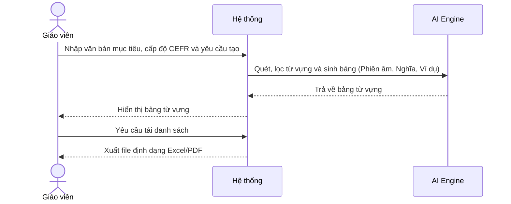

# NHÓM 1: SOẠN GIẢNG VÀ TẠO NỘI DUNG (LESSON & CONTENT CREATION)

**Actor (Người dùng):** Giáo viên

## 1. UC-FT-001: Soạn giáo án (Lesson Planner)
* **Tình huống:** Giáo viên chuẩn bị cho bài giảng mới, cần một giáo án chi tiết và đáp ứng tiêu chuẩn của Bộ GD&ĐT.
* **Mô tả ngắn:** Dựa trên các thông tin giáo viên cung cấp (môn học, bài học, thời lượng, mục tiêu), hệ thống tự động sinh ra một khung giáo án hoàn chỉnh.
* **Kết quả dự kiến:** Một tài liệu giáo án có cấu trúc rõ ràng (Mục tiêu, Chuẩn bị, Hoạt động học tập, Đánh giá).
* **Luồng cơ bản:**
  | Hành động của tác nhân | Phản ứng của hệ thống | Dữ liệu |
  | :--- | :--- | :--- |
  | Người dùng nhập thông tin: Môn học, Lớp, Tên bài, Mục tiêu, Thời lượng và yêu cầu tạo. | Hệ thống kiểm tra dữ liệu, gửi cho AI xử lý và sinh ra khung giáo án chi tiết. | - Môn, Lớp, Tên bài* - Mục tiêu bài học* |
  | Người dùng xem kết quả, chỉnh sửa (nếu cần) và bấm lưu. | Hệ thống cập nhật bản thảo, xuất file (Docx/PDF) và lưu vào hồ sơ cá nhân. | - Tệp giáo án |
* **Luồng ngoại lệ:** Thiếu thông tin bắt buộc: Hệ thống cảnh báo đỏ ở các trường bị thiếu và chặn nút Tạo.
* **Yêu cầu đặc biệt:** Giáo án phải có phần phân bổ thời gian cho từng hoạt động.
* **Tiền điều kiện:** Người dùng đăng nhập với vai trò Giáo viên.
* **Điều kiện sau:** Có bản lưu giáo án trên hệ thống.
* **Điểm mở rộng:** Kết nối thư viện bài giảng điện tử để đề xuất hình ảnh minh họa.

### Biểu đồ tuần tự (Sequence Diagram)

## 2. UC-FT-002: Tạo slide bài giảng (Presentation Maker)
* **Tình huống:** Giáo viên đã có dàn ý giáo án hoặc nội dung sách giáo khoa và muốn tạo Slide trình chiếu nhanh chóng.
* **Mô tả ngắn:** Chuyển đổi văn bản/vật liệu đầu vào thành các slide bài giảng được phân chia nội dung hợp lý (Chưa bao gồm thiết kế đồ họa phức tạp).
* **Kết quả dự kiến:** Danh sách các cấu trúc Slide (Tiêu đề, Nội dung chính, Ghi chú cho giáo viên).
* **Luồng cơ bản:**
  | Hành động của tác nhân | Phản ứng của hệ thống | Dữ liệu |
  | :--- | :--- | :--- |
  | Người dùng tải lên tài liệu (văn bản/PDF) và nhập số lượng slide, yêu cầu sinh slide. | Hệ thống trích xuất nội dung, gửi AI tóm tắt, phân bổ ý vào từng slide. | - Tệp tài liệu* - Số slide* |
  | Người dùng tải file kết quả về máy. | Hệ thống xuất kết quả thành định dạng tệp trình chiếu (.pptx hoặc văn bản cấu trúc). | - Tệp Slide |
* **Luồng ngoại lệ:** Tệp tải lên quá lớn hoặc sai định dạng: Hệ thống báo lỗi và yêu cầu tải lại tệp (tối đa 10MB, hỗ trợ docx/pdf).
* **Yêu cầu đặc biệt:** Nội dung trên slide cần súc tích (dạng gạch đầu dòng), chuyển phần nội dung chi tiết xuống Speaker Notes.
* **Tiền điều kiện:** Người dùng đăng nhập với vai trò Giáo viên.
* **Điều kiện sau:** Giáo viên tải được tệp cấu trúc slide về máy.
* **Điểm mở rộng:** Không có.

### Biểu đồ tuần tự (Sequence Diagram)

## 3. UC-FT-003: Tạo bài tập thực hành (Worksheet Generator)
* **Tình huống:** Sau tiết học, giáo viên cần tạo phiếu bài tập nhanh để học sinh ôn luyện kiến thức vừa học.
* **Mô tả ngắn:** AI sinh ra các dạng bài tập thực hành (điền khuyết, ghép từ, trả lời ngắn) dựa trên chủ đề và mức độ khó do giáo viên thiết lập.
* **Kết quả dự kiến:** Phiếu bài tập (Worksheet) gồm câu hỏi và đáp án tách biệt.
* **Luồng cơ bản:**
  | Hành động của tác nhân | Phản ứng của hệ thống | Dữ liệu |
  | :--- | :--- | :--- |
  | Người dùng chọn tính năng, nhập thông tin (Chủ đề, khối lớp, độ khó) và yêu cầu tạo bài tập. | Hệ thống kiểm tra đầu vào, AI phân tích và sinh danh sách câu hỏi kèm định dạng phiếu. | - Chủ đề* - Độ tuổi* - Mức độ khó (* Dữ liệu bắt buộc) |
  | Người dùng chọn lưu hoặc tải xuống. | Hệ thống xuất file (PDF/Word) và lưu vào hồ sơ cá nhân. | - Tệp bài tập |
* **Luồng ngoại lệ:** Không có đủ dữ liệu từ khóa: Hệ thống yêu cầu bổ sung từ khóa rõ ràng hơn.
* **Yêu cầu đặc biệt:** Cần có hướng dẫn làm bài cho từng dạng câu hỏi.
* **Tiền điều kiện:** Người dùng đăng nhập với vai trò Giáo viên.
* **Điều kiện sau:** Phiếu bài tập sẵn sàng để in ấn hoặc giao online.
* **Điểm mở rộng:** Tự động gửi phiếu bài tập vào danh sách "Bài tập về nhà" của học sinh.

### Biểu đồ tuần tự (Sequence Diagram)

## 4. UC-FT-004: Tạo nội dung học thuật (Academic Content Generator)
* **Tình huống:** Giáo viên cần tài liệu đọc thêm, văn bản mẫu hoặc tóm tắt lý thuyết để bổ sung vào giáo trình.
* **Mô tả ngắn:** Giáo viên sử dụng công cụ để tạo các đoạn văn bản, tài liệu đọc thêm hoặc lý thuyết chuyên sâu phù hợp với trình độ học sinh.
* **Kết quả dự kiến:** Một đoạn văn bản học thuật chuẩn xác, đúng ngữ pháp và mức độ đọc hiểu của học sinh.
* **Luồng cơ bản:**
  | Hành động của tác nhân | Phản ứng của hệ thống | Dữ liệu |
  | :--- | :--- | :--- |
  | Người dùng nhập chủ đề, từ khóa, cấp độ học sinh và yêu cầu tạo văn bản. | Hệ thống kiểm tra tính hợp lệ, AI xử lý và sinh ra nội dung học thuật tương ứng. | - Chủ đề* - Cấp độ* - Độ dài mong muốn |
  | Người dùng chỉnh sửa (nếu cần) và chọn lưu. | Hệ thống cập nhật bản lưu vào cơ sở dữ liệu cá nhân của người dùng. | - Tệp văn bản (.docx/.pdf) |
* **Luồng ngoại lệ:** Thiếu từ khóa/chủ đề: Hệ thống báo đỏ ô nhập liệu và yêu cầu bổ sung.
* **Yêu cầu đặc biệt:** Văn phong phải chuẩn mực, cung cấp thông tin chính xác, khách quan.
* **Tiền điều kiện:** Người dùng đăng nhập với vai trò Giáo viên.
* **Điều kiện sau:** Có văn bản học thuật hoàn chỉnh để đưa vào giáo án.
* **Điểm mở rộng:** Không có.

### Biểu đồ tuần tự (Sequence Diagram)

## 5. UC-FT-005: Tạo bài kiểm tra trắc nghiệm (Multiple Choice Quiz)
* **Tình huống:** Giáo viên muốn tổ chức kiểm tra bài cũ đầu giờ (15 phút) hoặc bài thi giữa kỳ môn học.
* **Mô tả ngắn:** Tự động tạo bộ câu hỏi trắc nghiệm nhiều lựa chọn kèm đáp án dựa trên đoạn văn bản hoặc chủ đề được cung cấp.
* **Kết quả dự kiến:** Bộ câu hỏi trắc nghiệm kèm theo đáp án và giải thích chi tiết.
* **Luồng cơ bản:**
  | Hành động của tác nhân | Phản ứng của hệ thống | Dữ liệu |
  | :--- | :--- | :--- |
  | Người dùng cung cấp ngữ liệu (dán văn bản/chủ đề), chọn số lượng và bấm "Tạo Quiz". | Hệ thống phân tích ngữ liệu, AI sinh danh sách câu hỏi (kèm 4 đáp án và đánh dấu đáp án đúng). | - Ngữ liệu/Chủ đề* - Số lượng câu* |
  | Người dùng xuất file hoặc đưa lên nền tảng thi trực tuyến. | Hệ thống định dạng file xuất (Word/CSV) và tải xuống. | - Tệp trắc nghiệm |
* **Luồng ngoại lệ:** Ngữ liệu quá ngắn: Hệ thống thông báo không đủ dữ kiện để tạo đủ số lượng câu hỏi yêu cầu.
* **Yêu cầu đặc biệt:** Đảm bảo có duy nhất 1 đáp án đúng cho mỗi câu, các đáp án gây nhiễu (distractors) phải hợp lý.
* **Tiền điều kiện:** Người dùng đăng nhập với vai trò Giáo viên.
* **Điều kiện sau:** Có tệp Quiz sẵn sàng để học sinh làm bài.
* **Điểm mở rộng:** Tích hợp trực tiếp lên các nền tảng như Kahoot, Quizizz.

### Biểu đồ tuần tự (Sequence Diagram)

## 6. UC-FT-006: Tạo danh sách từ vựng (Vocabulary List Generator)
* **Tình huống:** Giáo viên ngoại ngữ hoặc môn chuyên ngành cần cung cấp các từ vựng cốt lõi trước khi học sinh đọc một đoạn văn bản khó.
* **Mô tả ngắn:** Hệ thống trích xuất và định nghĩa các từ vựng quan trọng từ một văn bản để học sinh chuẩn bị trước khi đọc hiểu.
* **Kết quả dự kiến:** Danh sách từ vựng kèm nghĩa, loại từ và câu ví dụ minh họa.
* **Luồng cơ bản:**
  | Hành động của tác nhân | Phản ứng của hệ thống | Dữ liệu |
  | :--- | :--- | :--- |
  | Người dùng cung cấp văn bản, chọn cấp độ CEFR và yêu cầu tạo danh sách. | Hệ thống quét văn bản, AI lọc từ vựng theo cấp độ và trả về bảng chi tiết (Từ, Loại từ, Phiên âm, Nghĩa, Ví dụ). | - Văn bản gốc* - Cấp độ từ vựng* |
  | Người dùng tải danh sách về. | Hệ thống xuất file định dạng bảng (Excel/PDF). | - Tệp từ vựng |
* **Luồng ngoại lệ:** Văn bản không chứa từ vựng ở cấp độ đã chọn: Hệ thống thông báo và gợi ý hạ/tăng cấp độ.
* **Yêu cầu đặc biệt:** Cung cấp câu ví dụ phải bám sát ngữ cảnh của văn bản gốc.
* **Tiền điều kiện:** Người dùng đăng nhập với vai trò Giáo viên.
* **Điều kiện sau:** Giáo viên có danh sách từ vựng chuẩn bị cho bài giảng.
* **Điểm mở rộng:** Không có.

### Biểu đồ tuần tự (Sequence Diagram)

