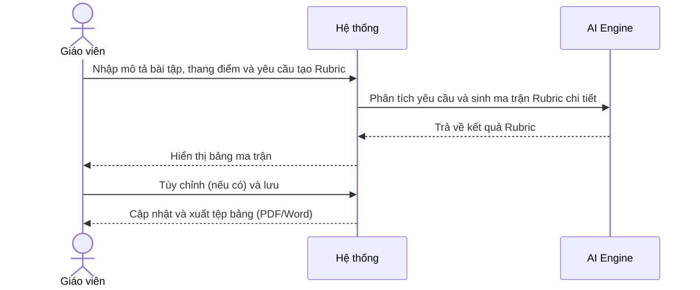
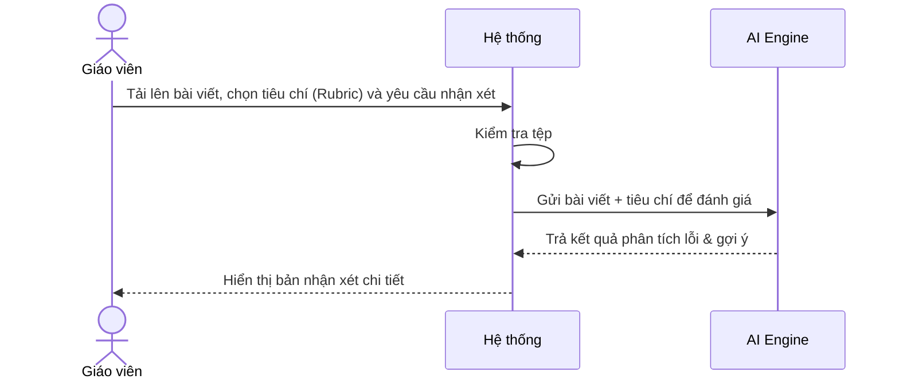
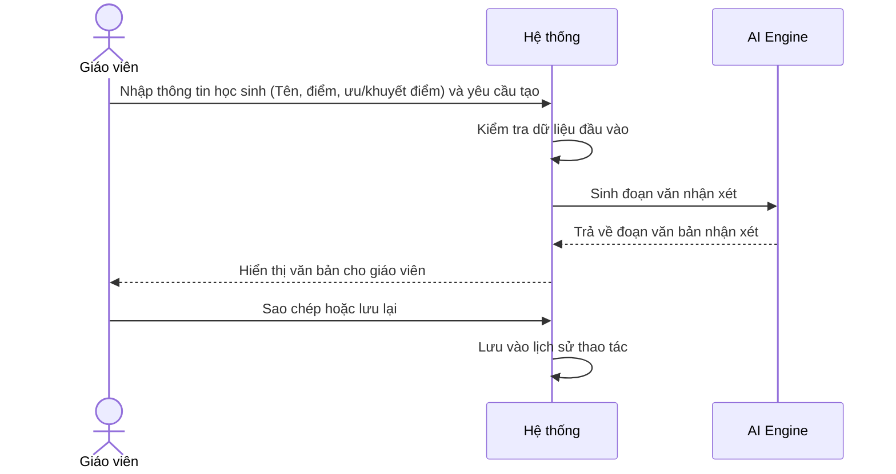
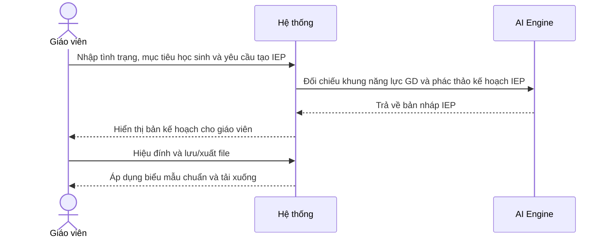

# NHÓM 2: ĐÁNH GIÁ VÀ PHẢN HỒI (ASSESSMENT & FEEDBACK)

**Actor (Người dùng):** Giáo viên

## 1. UC-FT-007: Tạo thang điểm đánh giá (Rubric Generator)
* **Tình huống:** Giáo viên giao một dự án làm việc nhóm hoặc bài tự luận và cần một thang điểm minh bạch để chấm điểm công bằng.
* **Mô tả ngắn:** Dựa trên mô tả bài tập, hệ thống sinh ra bảng tiêu chí (Rubric) đánh giá chi tiết theo từng cấp độ hoàn thành.
* **Kết quả dự kiến:** Bảng ma trận Rubric phân chia rõ ràng tiêu chí (Hàng) và mức độ xuất sắc (Cột).
* **Luồng cơ bản:**
  | Hành động của tác nhân | Phản ứng của hệ thống | Dữ liệu |
  | :--- | :--- | :--- |
  | Người dùng nhập mô tả bài tập, thang điểm và yêu cầu tạo Rubric. | Hệ thống gửi yêu cầu cho AI phân tích và sinh ra bảng ma trận gồm các tiêu chí/mức điểm. | - Mô tả bài tập* - Thang điểm* |
  | Người dùng tùy chỉnh text và bấm lưu. | Hệ thống cập nhật thay đổi và xuất tệp dạng bảng. | - Tệp Rubric (PDF/Word) |
* **Luồng ngoại lệ:** Mô tả bài tập quá chung chung: Hệ thống yêu cầu bổ sung mục tiêu cụ thể (VD: rèn kỹ năng gì).
* **Yêu cầu đặc biệt:** Rubric phải có ngôn từ rõ ràng, phân biệt được ranh giới giữa các mức điểm.
* **Tiền điều kiện:** Người dùng đăng nhập với vai trò Giáo viên.
* **Điều kiện sau:** Có file tiêu chí chấm điểm để gửi cho học sinh trước khi làm bài.
* **Điểm mở rộng:** Không có.

### Biểu đồ tuần tự (Sequence Diagram)

## 2. UC-FT-008: Chấm và phản hồi bài viết (Writing Feedback)
* **Tình huống:** Sau bài kiểm tra viết luận tiếng Anh hoặc Ngữ Văn, giáo viên có hàng chục bài cần chấm và nhận xét chi tiết.
* **Mô tả ngắn:** AI quét văn bản của học sinh, phát hiện lỗi ngữ pháp, cấu trúc câu và đưa ra lời khuyên sửa chữa mang tính xây dựng.
* **Kết quả dự kiến:** Bài viết được highlight lỗi và kèm theo nhận xét tổng quan/chi tiết.
* **Luồng cơ bản:**
  | Hành động của tác nhân | Phản ứng của hệ thống | Dữ liệu |
  | :--- | :--- | :--- |
  | Người dùng tải văn bản/bài viết của học sinh lên, chọn tiêu chí đánh giá (Rubric) và yêu cầu nhận xét. | Hệ thống đọc nội dung tệp, AI phân tích bài viết dựa trên Rubric và trả về bảng đánh giá lỗi kèm gợi ý sửa. | - Tệp văn bản* - Tiêu chí đánh giá |
  | Người dùng xuất hoặc copy bản nhận xét. | Hệ thống ghi nhận kết quả lưu vào lịch sử. | - Kết quả phản hồi |
* **Luồng ngoại lệ:** Tệp tải lên mờ, không rõ chữ (nếu là ảnh): Hệ thống báo lỗi OCR không đọc được, yêu cầu nhập text trực tiếp.
* **Yêu cầu đặc biệt:** Nhận xét cần tuân thủ nguyên tắc sư phạm "Sandwich feedback" (Khen ngợi - Chỉ ra lỗi - Khích lệ).
* **Tiền điều kiện:** Người dùng đăng nhập với vai trò Giáo viên.
* **Điều kiện sau:** Giáo viên có nhận xét sẵn sàng gửi cho học sinh.
* **Điểm mở rộng:** Tự động quy đổi điểm dựa trên số lượng lỗi.

### Biểu đồ tuần tự (Sequence Diagram)

## 3. UC-FT-009: Tạo nhận xét sổ liên lạc (Report Card Comments)
* **Tình huống:** Cuối học kỳ, giáo viên chủ nhiệm cần viết nhận xét cho 40 học sinh vào sổ liên lạc nhưng sợ lặp từ và khô khan.
* **Mô tả ngắn:** Sinh đoạn văn nhận xét học bạ dựa trên từ khóa về điểm mạnh, điểm yếu và điểm số của từng cá nhân học sinh.
* **Kết quả dự kiến:** Lời nhận xét súc tích, chuyên nghiệp, làm hài lòng phụ huynh và khích lệ học sinh.
* **Luồng cơ bản:**
  | Hành động của tác nhân | Phản ứng của hệ thống | Dữ liệu |
  | :--- | :--- | :--- |
  | Người dùng nhập thông tin (Tên học sinh, điểm, ưu/khuyết điểm) và yêu cầu tạo nhận xét. | Hệ thống kiểm tra dữ liệu, AI sinh ra đoạn văn nhận xét chuyên nghiệp và khích lệ. | - Tên, Giới tính* - Đặc điểm học tập* |
  | Người dùng copy hoặc lưu lại. | Hệ thống lưu lịch sử thao tác vào thư mục cá nhân. | - Lịch sử nhận xét |
* **Luồng ngoại lệ:** Nhập toàn điểm yếu tiêu cực: AI từ chối sinh ra lời lẽ gay gắt, gợi ý giáo viên đổi thành ngôn ngữ "cần cải thiện".
* **Yêu cầu đặc biệt:** Văn phong trang trọng nhưng gần gũi, tuyệt đối không dùng ngôn từ miệt thị hay phân biệt đối xử.
* **Tiền điều kiện:** Người dùng đăng nhập với vai trò Giáo viên.
* **Điều kiện sau:** Có nhận xét để dán vào hệ thống Sổ liên lạc điện tử (SMAS, VnEdu).
* **Điểm mở rộng:** Hỗ trợ nhập hàng loạt bằng tệp Excel (Batch processing).

### Biểu đồ tuần tự (Sequence Diagram)

## 4. UC-FT-010: Tạo kế hoạch giáo dục cá nhân (IEP Generator)
* **Tình huống:** Đối với học sinh có nhu cầu đặc biệt (chậm tiếp thu, tăng động), giáo viên cần lên một Kế hoạch giáo dục cá nhân (IEP) trong suốt năm học.
* **Mô tả ngắn:** Hỗ trợ giáo viên định hình các mục tiêu ngắn/dài hạn và phương pháp can thiệp cho từng cá nhân dựa trên hồ sơ hiện tại.
* **Kết quả dự kiến:** Bản IEP chuẩn hóa với các chỉ số đo lường (SMART).
* **Luồng cơ bản:**
  | Hành động của tác nhân | Phản ứng của hệ thống | Dữ liệu |
  | :--- | :--- | :--- |
  | Người dùng nhập tình trạng, mục tiêu học sinh và bấm tạo IEP. | Hệ thống gửi thông tin cho AI để đối chiếu khung năng lực và phác thảo kế hoạch IEP. | - Tình trạng học sinh* - Mục tiêu dự kiến* |
  | Người dùng hiệu đính và xuất file. | Hệ thống định dạng theo biểu mẫu chuẩn của trường học và tải file xuống. | - Tệp hồ sơ IEP |
* **Luồng ngoại lệ:** Mục tiêu đặt ra quá phi thực tế: Hệ thống nhắc nhở giáo viên chia nhỏ mục tiêu thành các giai đoạn nhỏ hơn.
* **Yêu cầu đặc biệt:** Phải bảo mật dữ liệu y tế, tâm lý của học sinh tuyệt đối.
* **Tiền điều kiện:** Người dùng đăng nhập với vai trò Giáo viên.
* **Điều kiện sau:** Có lộ trình can thiệp giáo dục cho học sinh.
* **Điểm mở rộng:** Không có.

### Biểu đồ tuần tự (Sequence Diagram)

