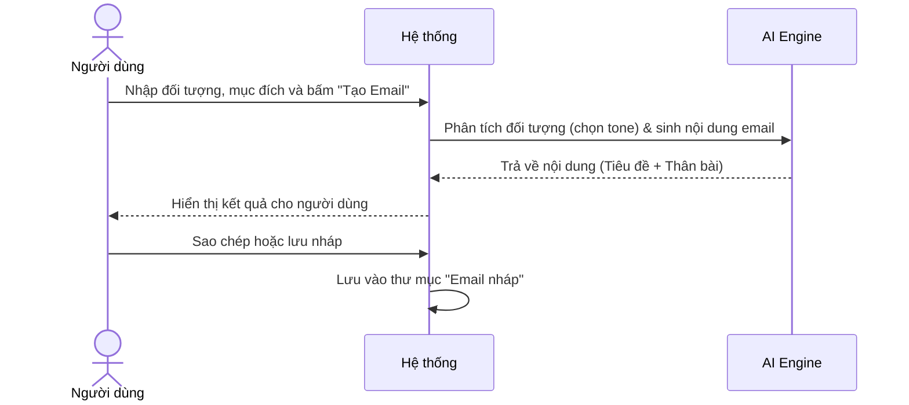
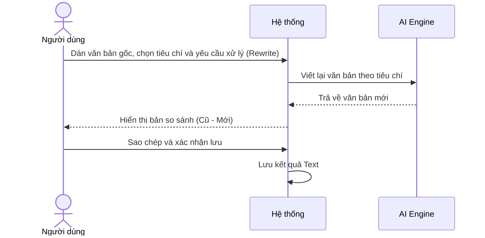
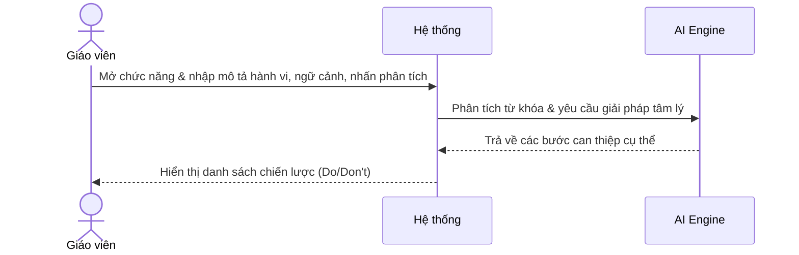
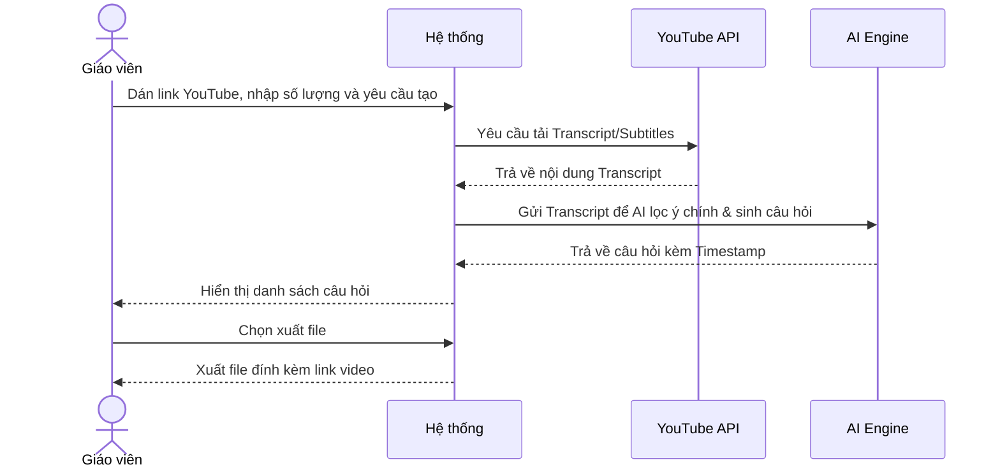

# NHÓM 3: GIAO TIẾP VÀ QUẢN LÝ (COMMUNICATION & ADMIN)

**Actor (Người dùng):** Giáo viên, Quản lý trường học

## 1. UC-FT-011: Soạn email chuyên nghiệp (Professional Email)
* **Tình huống:** Giáo viên cần gửi email mời phụ huynh họp hoặc Quản lý cần gửi thông báo đến toàn trường nhưng không có thời gian trau chuốt từ ngữ.
* **Mô tả ngắn:** AI hỗ trợ viết email đầy đủ tiêu đề, lời chào, nội dung chính và lời kết bám sát mục đích và đối tượng người nhận.
* **Kết quả dự kiến:** Nội dung email mạch lạc, lịch sự.
* **Luồng cơ bản:**
  | Hành động của tác nhân | Phản ứng của hệ thống | Dữ liệu |
  | :--- | :--- | :--- |
  | Người dùng chọn đối tượng nhận, ghi tóm tắt mục đích và bấm "Tạo Email". | Hệ thống gửi dữ liệu cho AI phân tích đối tượng (chọn tone giọng) và sinh ra nội dung email hoàn chỉnh. | - Người nhận* - Mục đích* |
  | Người dùng sao chép để gửi hoặc lưu lại. | Hệ thống lưu trữ vào mục "Email nháp" của hồ sơ. | - Bản lưu nháp |
* **Luồng ngoại lệ:** Nội dung tóm tắt quá sơ sài: Hệ thống sinh ra email có chứa các khoảng trống "[Điền thông tin...]" để người dùng tự bổ sung.
* **Yêu cầu đặc biệt:** Không có.
* **Tiền điều kiện:** Người dùng đã đăng nhập.
* **Điều kiện sau:** Có sẵn nội dung text để paste vào Gmail/Outlook.
* **Điểm mở rộng:** Gửi email trực tiếp từ hệ thống nếu được tích hợp SMTP.

### Biểu đồ tuần tự (Sequence Diagram)

## 2. UC-FT-012: Điều chỉnh văn phong tài liệu (Text Rewriter)
* **Tình huống:** Quản lý có một dự thảo nội quy rất cứng nhắc, muốn viết lại cho mềm mỏng hơn để gửi cho học sinh.
* **Mô tả ngắn:** Viết lại (Paraphrase) đoạn văn bản theo tone giọng được chỉ định (trang trọng, thân thiện, súc tích).
* **Kết quả dự kiến:** Đoạn văn bản mới giữ nguyên ý nhưng thay đổi từ vựng, cấu trúc.
* **Luồng cơ bản:**
  | Hành động của tác nhân | Phản ứng của hệ thống | Dữ liệu |
  | :--- | :--- | :--- |
  | Người dùng dán văn bản gốc, chọn tiêu chí (VD: thân thiện hơn) và yêu cầu xử lý. | Hệ thống ghi nhận yêu cầu, AI thực hiện viết lại văn bản theo đúng tiêu chí văn phong. | - Văn bản gốc* - Tiêu chí viết lại* |
  | Người dùng kiểm tra và xác nhận lưu. | Hệ thống hiển thị bản so sánh (nếu cần) và lưu kết quả Text. | - Kết quả Text |
* **Luồng ngoại lệ:** Văn bản gốc có chứa ngôn từ vi phạm thuần phong mỹ tục: Hệ thống từ chối rewrite và cảnh báo nội dung không phù hợp.
* **Yêu cầu đặc biệt:** Không làm mất ý chính (fact) của văn bản gốc.
* **Tiền điều kiện:** Người dùng đã đăng nhập.
* **Điều kiện sau:** Có văn bản mới để sử dụng ngay.
* **Điểm mở rộng:** Không có.

### Biểu đồ tuần tự (Sequence Diagram)

## 3. UC-FT-013: Tìm kiếm giải pháp can thiệp hành vi (Behavior Intervention)
* **Tình huống:** Một học sinh thường xuyên ngủ gật và gây rối trong giờ. Giáo viên cần một chiến lược để giải quyết tình trạng này theo hướng tích cực.
* **Mô tả ngắn:** AI đóng vai trò như một chuyên gia tâm lý học đường, đưa ra các cách xử lý tình huống sư phạm dựa trên lý thuyết tâm lý.
* **Kết quả dự kiến:** Danh sách các hành động khuyên làm (Do) và không nên làm (Don't).
* **Luồng cơ bản:**
  | Hành động của tác nhân | Phản ứng của hệ thống | Dữ liệu |
  | :--- | :--- | :--- |
  | Người dùng chọn chức năng Can thiệp hành vi, mô tả hành vi của học sinh và nhấn phân tích. | Hệ thống gửi thông tin cho AI phân tích từ khóa hành vi và đưa ra danh sách các bước can thiệp tâm lý cụ thể. | - Mô tả hành vi* - Ngữ cảnh |
  | Người dùng đọc và lưu giải pháp. | Hệ thống lưu lại giải pháp vào hồ sơ lớp học. | - Danh sách giải pháp |
* **Luồng ngoại lệ:** Mô tả mang tính chất bạo lực học đường nghiêm trọng: Hệ thống lập tức gợi ý báo cáo lên Ban giám hiệu thay vì tự xử lý.
* **Yêu cầu đặc biệt:** Phương pháp phải mang tính giáo dục, tuân thủ đạo đức nghề nghiệp.
* **Tiền điều kiện:** Người dùng đăng nhập với vai trò Giáo viên/Quản lý.
* **Điều kiện sau:** Người dùng có phương pháp để tiếp cận học sinh.
* **Điểm mở rộng:** Không có.

### Biểu đồ tuần tự (Sequence Diagram)

## 4. UC-FT-014: Tạo câu hỏi từ video YouTube (YouTube Video Questions)
* **Tình huống:** Giáo viên muốn cho học sinh xem một video tài liệu trên YouTube và kiểm tra xem học sinh có chú ý nghe không.
* **Mô tả ngắn:** Trích xuất nội dung từ Video YouTube và tự động tạo bộ câu hỏi có đính kèm thời gian (timestamp).
* **Kết quả dự kiến:** Bộ câu hỏi bám sát nội dung video, học sinh có thể click vào timestamp để xem lại đoạn video chứa đáp án.
* **Luồng cơ bản:**
  | Hành động của tác nhân | Phản ứng của hệ thống | Dữ liệu |
  | :--- | :--- | :--- |
  | Người dùng dán link YouTube, nhập số lượng và yêu cầu tạo câu hỏi. | Hệ thống tải phụ đề (Transcript) thông qua YouTube API, AI phân tích, lọc ý chính và sinh câu hỏi kèm timestamp. | - Link YouTube* - Số lượng câu hỏi* |
  | Người dùng xuất danh sách. | Hệ thống tạo file tài liệu đính kèm link video. | - Tệp câu hỏi |
* **Luồng ngoại lệ:** Video không có phụ đề (Closed Captions): Hệ thống thông báo lỗi "Video không hỗ trợ trích xuất phụ đề, vui lòng sử dụng video khác".
* **Yêu cầu đặc biệt:** Độ dài video hỗ trợ tối đa không quá 30 phút.
* **Tiền điều kiện:** Người dùng đã đăng nhập.
* **Điều kiện sau:** Có danh sách câu hỏi xem video.
* **Điểm mở rộng:** Tự động cắt ngắn video thành các đoạn nhỏ.

### Biểu đồ tuần tự (Sequence Diagram)

