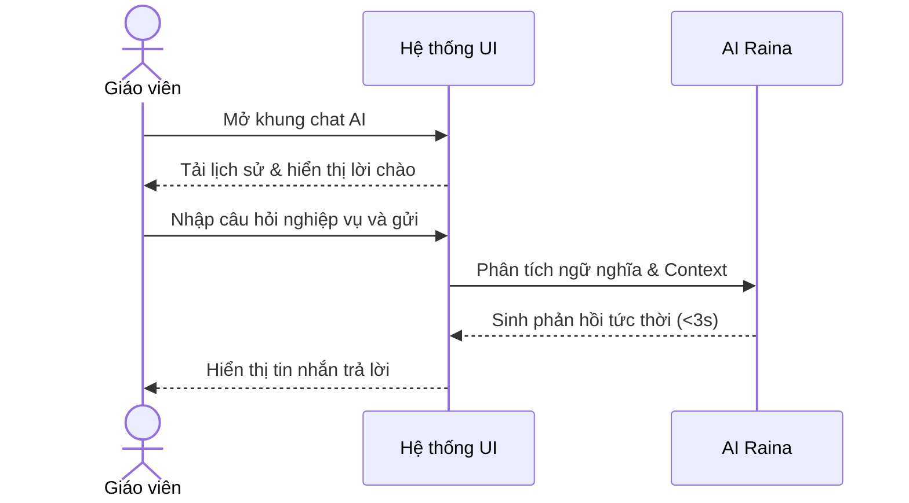
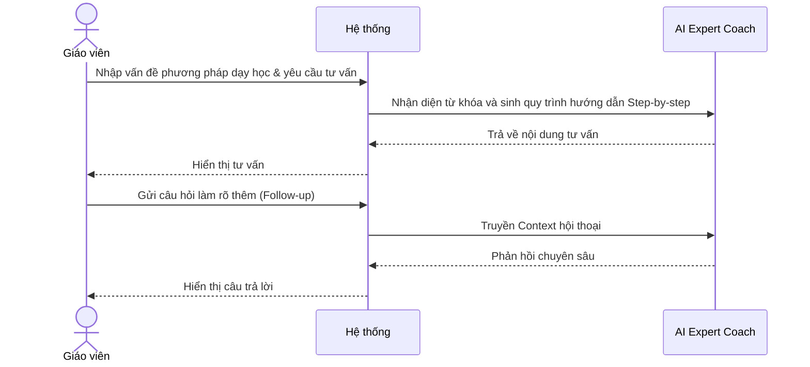
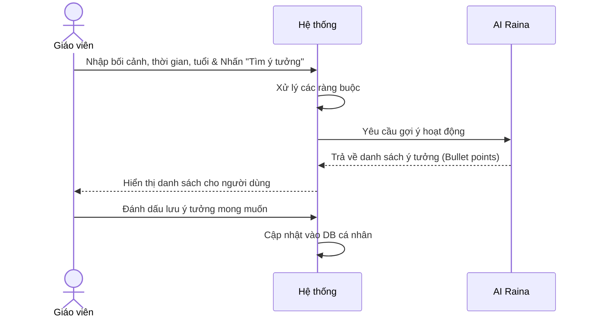

# NHÓM 4: TRỢ LÝ SƯ PHẠM ẢO (AI ASSISTANT)

**Actor (Người dùng):** Giáo viên

## 1. UC-FT-015: Trao đổi với Trợ lý sư phạm (Raina AI Chatbot)
* **Tình huống:** Giáo viên có một thắc mắc nhỏ gọn, hoặc cần tham khảo ý kiến tức thì trong quá trình làm việc.
* **Mô tả ngắn:** Giao diện Chatbot giống ChatGPT, nhưng đã được tinh chỉnh (Fine-tuned) với kiến thức sư phạm và giáo dục.
* **Kết quả dự kiến:** Tin nhắn phản hồi nhanh chóng, đúng trọng tâm.
* **Luồng cơ bản:**
  | Hành động của tác nhân | Phản ứng của hệ thống | Dữ liệu |
  | :--- | :--- | :--- |
  | Người dùng mở khung chat và nhập câu hỏi/yêu cầu, nhấn gửi. | Hệ thống hiển thị tin nhắn, gửi tới AI Raina phân tích ngữ nghĩa và sinh phản hồi tức thời. | - Câu hỏi dạng văn bản* |
  | Người dùng đọc phản hồi và tiếp tục hội thoại. | AI Raina lưu trữ ngữ cảnh và tiếp tục trả lời các câu hỏi nối tiếp. | - Nội dung phản hồi |
* **Luồng ngoại lệ:** Lỗi kết nối mạng: Hệ thống báo "Đang mất kết nối với máy chủ AI, vui lòng thử lại sau".
* **Yêu cầu đặc biệt:** Phản hồi dưới 3 giây.
* **Tiền điều kiện:** Người dùng đăng nhập.
* **Điều kiện sau:** Trải nghiệm giải đáp thắc mắc thông suốt.
* **Điểm mở rộng:** Tích hợp tính năng Voice-to-Text.

### Biểu đồ tuần tự (Sequence Diagram)

## 2. UC-FT-016: Hướng dẫn phương pháp giảng dạy (AI Instructional Coach)
* **Tình huống:** Giáo viên trẻ chưa có nhiều kinh nghiệm muốn tìm hiểu cách áp dụng phương pháp "Lớp học đảo ngược" (Flipped Classroom) vào môn Toán.
* **Mô tả ngắn:** AI đóng vai trò người huấn luyện, hướng dẫn giáo viên các bước thực thi một phương pháp giáo dục hiện đại vào thực tiễn.
* **Kết quả dự kiến:** Hướng dẫn thực hành Step-by-step.
* **Luồng cơ bản:**
  | Hành động của tác nhân | Phản ứng của hệ thống | Dữ liệu |
  | :--- | :--- | :--- |
  | Người dùng nhập vấn đề sư phạm đang gặp phải và yêu cầu tư vấn. | Hệ thống gọi AI Expert Coach phân tích từ khóa chuyên ngành, sinh quy trình hướng dẫn step-by-step. | - Vấn đề/Câu hỏi* |
  | Người dùng đọc và gửi câu hỏi làm rõ thêm (Follow-up). | Hệ thống duy trì ngữ cảnh, AI phản hồi chuyên sâu hơn. | - Lịch sử hội thoại |
* **Luồng ngoại lệ:** Phương pháp không tồn tại hoặc tên bị sai: AI sẽ cố gắng hiểu ý định hoặc hỏi lại để xác nhận đúng phương pháp chuẩn.
* **Yêu cầu đặc biệt:** Trích dẫn cơ sở lý thuyết (nếu có).
* **Tiền điều kiện:** Người dùng đăng nhập.
* **Điều kiện sau:** Giáo viên hiểu cách triển khai phương pháp.
* **Điểm mở rộng:** Không có.

### Biểu đồ tuần tự (Sequence Diagram)

## 3. UC-FT-017: Tạo ý tưởng sáng tạo (Idea Generator)
* **Tình huống:** Cần tổ chức hoạt động sinh hoạt lớp ngày Quốc tế Phụ Nữ nhưng bí ý tưởng, cần các trò chơi mang tính gắn kết.
* **Mô tả ngắn:** Công cụ sinh ý tưởng (Brainstorming) dựa trên các ràng buộc về thời gian, đối tượng và ngân sách.
* **Kết quả dự kiến:** Danh sách các ý tưởng ngắn gọn, mang tính đột phá.
* **Luồng cơ bản:**
  | Hành động của tác nhân | Phản ứng của hệ thống | Dữ liệu |
  | :--- | :--- | :--- |
  | Người dùng nhập bối cảnh sự kiện, thời gian, lứa tuổi và nhấn "Tìm ý tưởng". | Hệ thống xử lý ràng buộc, yêu cầu AI gợi ý hoạt động và trả về danh sách các ý tưởng khả thi (bullet points). | - Bối cảnh/Sự kiện* - Yêu cầu cụ thể |
  | Người dùng đánh dấu lưu ý tưởng mong muốn. | Hệ thống cập nhật vào thư mục ý tưởng cá nhân của tài khoản. | - Dữ liệu đã lưu |
* **Luồng ngoại lệ:** Ràng buộc quá vô lý (VD: Tổ chức lễ cắm trại trong 5 phút): AI sẽ phản hồi hài hước và yêu cầu chỉnh sửa lại thời gian khả thi.
* **Yêu cầu đặc biệt:** Đề xuất tính mới lạ, tránh lối mòn cũ.
* **Tiền điều kiện:** Người dùng đăng nhập.
* **Điều kiện sau:** Có danh sách ý tưởng để thảo luận.
* **Điểm mở rộng:** Cung cấp link mua vật dụng nếu có.

### Biểu đồ tuần tự (Sequence Diagram)

