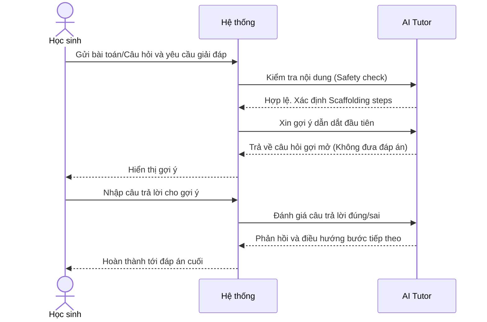
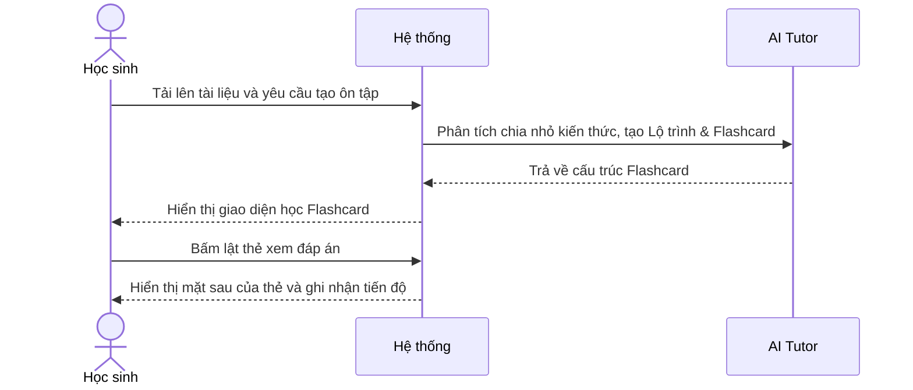
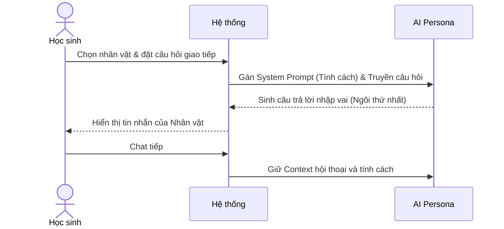
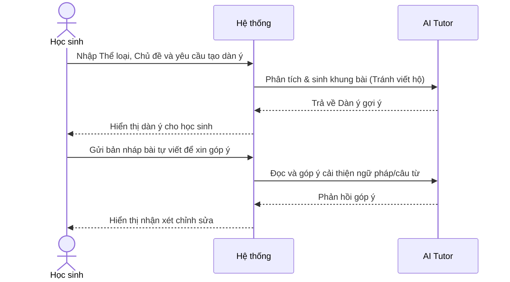
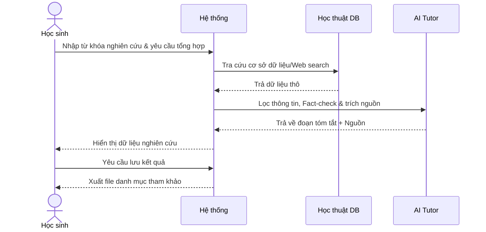
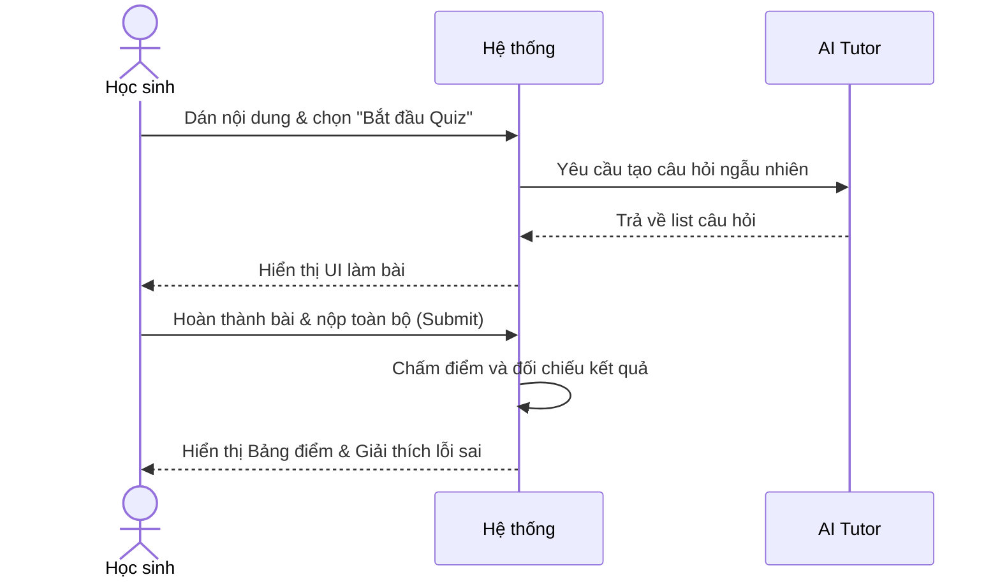
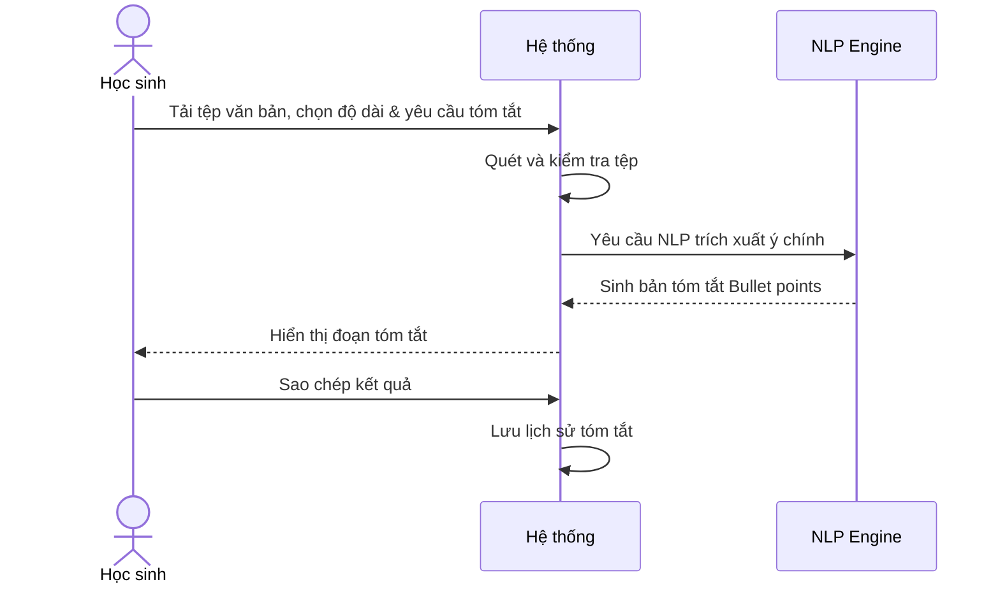
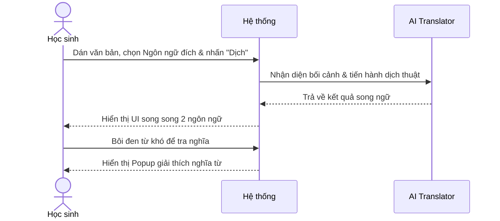

# NHÓM 5: MAGICSTUDENT (TÍNH NĂNG DÀNH CHO HỌC SINH)

**Actor (Người dùng):** Học sinh

## 1. UC-FS-001: Học kèm 1-1 với Gia sư AI (AI Tutor)
* **Tình huống:** Học sinh gặp bài toán khó ở nhà, không có giáo viên bên cạnh để hỏi. Cần một người hướng dẫn cách làm.
* **Mô tả ngắn:** Học sinh chụp ảnh hoặc nhập đề bài, AI Tutor sẽ đóng vai gia sư. **Đặc biệt:** AI không bao giờ đưa ra đáp án cuối cùng ngay lập tức, mà dùng phương pháp "Scaffolding" (giàn giáo) - đặt câu hỏi gợi mở để học sinh tự suy nghĩ và giải quyết từng bước.
* **Kết quả dự kiến:** Học sinh hiểu được bản chất vấn đề và tự tìm ra đáp án.
* **Luồng cơ bản:**
  | Hành động của tác nhân | Phản ứng của hệ thống | Dữ liệu |
  | :--- | :--- | :--- |
  | Người dùng gửi đề bài (text/ảnh) và yêu cầu giải đáp. | Hệ thống gửi thông tin cho AI Tutor. AI phân tích, xác định các bước giải (Scaffolding steps) và trả về câu hỏi gợi mở đầu tiên. | - Đề bài* |
  | Người dùng nhập câu trả lời cho gợi ý đó. | AI Tutor đánh giá đúng/sai, phản hồi khích lệ và chuyển sang câu hỏi dẫn dắt tiếp theo cho đến khi ra kết quả. | - Tương tác của học sinh |
* **Luồng ngoại lệ:** 
  - **Học sinh liên tục trả lời sai/tỏ ra thất vọng:** AI Tutor chuyển đổi tông giọng sang dỗ dành, giảm độ khó của gợi ý hoặc chia nhỏ bài toán thêm nữa.
  - **Câu hỏi vi phạm nội dung (VD: Cách chế tạo chất nổ):** Hệ thống chặn ngay lập tức.
* **Yêu cầu đặc biệt:** Áp dụng nghiêm ngặt Safety Filter (Bộ lọc an toàn học đường).
* **Tiền điều kiện:** Học sinh đăng nhập tài khoản.
* **Điều kiện sau:** Hệ thống ghi nhận điểm tích cực cho học sinh.
* **Điểm mở rộng:** Báo cáo tổng hợp tiến độ học tập cho Giáo viên chủ nhiệm.

### Biểu đồ tuần tự (Sequence Diagram)

## 2. UC-FS-002: Hỗ trợ ôn tập học tập (Study Bot)
* **Tình huống:** Sắp đến kỳ thi cuối kỳ, học sinh bối rối trước một cuốn sách dày cộp, không biết bắt đầu ôn tập từ đâu.
* **Mô tả ngắn:** Hệ thống chuyển hóa tài liệu thô thành Lộ trình học tập (Study Plan) và bộ Thẻ ghi nhớ (Flashcard) tự động.
* **Kết quả dự kiến:** Lịch trình ôn thi chia theo ngày và bộ thẻ Flashcard tương tác.
* **Luồng cơ bản:**
  | Hành động của tác nhân | Phản ứng của hệ thống | Dữ liệu |
  | :--- | :--- | :--- |
  | Người dùng tải lên tài liệu/chủ đề và yêu cầu tạo hỗ trợ ôn tập. | AI phân tích dung lượng kiến thức, tạo Lộ trình học tập & cấu trúc Flashcard. | - Tài liệu/Chủ đề* |
  | Người dùng thao tác lật thẻ Flashcard (xem đáp án). | Hệ thống hiển thị mặt sau của thẻ và ghi nhận tiến độ hoàn thành bài ôn tập. | - Thao tác lật thẻ |
* **Luồng ngoại lệ:** Không có.
* **Yêu cầu đặc biệt:** Sử dụng thuật toán lặp lại ngắt quãng (Spaced Repetition) để hiển thị thẻ flashcard.
* **Tiền điều kiện:** Học sinh đăng nhập tài khoản.
* **Điều kiện sau:** Có lộ trình ôn tập cá nhân hóa.

### Biểu đồ tuần tự (Sequence Diagram)

## 3. UC-FS-003: Chat với nhân vật lịch sử/văn học (Character Chatbot)
* **Tình huống:** Môn Lịch sử nhàm chán với những con số. Học sinh muốn "nói chuyện" trực tiếp với Vua Quang Trung để tìm hiểu trận Ngọc Hồi - Đống Đa.
* **Mô tả ngắn:** AI nhập vai (Roleplay) thành các nhân vật nổi tiếng. Trả lời câu hỏi bằng ngôi thứ nhất ("Ta", "Tôi") với tính cách, giọng điệu và kiến thức chuẩn lịch sử.
* **Kết quả dự kiến:** Đoạn hội thoại sinh động, truyền cảm hứng học tập.
* **Luồng cơ bản:**
  | Hành động của tác nhân | Phản ứng của hệ thống | Dữ liệu |
  | :--- | :--- | :--- |
  | Người dùng chọn/nhập tên nhân vật lịch sử và gửi câu hỏi trò chuyện. | AI kích hoạt System Prompt của nhân vật, nhận dữ liệu và sinh câu trả lời nhập vai (Ngôi thứ nhất). | - Tên nhân vật* - Câu hỏi của học sinh |
  | Người dùng tiếp tục trò chuyện. | Hệ thống duy trì Context và tính cách nhân vật xuyên suốt phiên chat. | - Phản hồi nhập vai |
* **Luồng ngoại lệ:** Học sinh hỏi sai bối cảnh lịch sử (VD: Hỏi vua Quang Trung về iPhone): Nhân vật sẽ từ chối một cách khéo léo và điều hướng về thời đại của mình.
* **Yêu cầu đặc biệt:** Thông tin lịch sử/văn học phải được fact-check (kiểm chứng) nghiêm ngặt để tránh sai lệch kiến thức.

### Biểu đồ tuần tự (Sequence Diagram)

## 4. UC-FS-005: Tạo nội dung sáng tạo (Content Creator)
* **Tình huống:** Làm bài tập làm văn nhưng học sinh không biết bắt đầu từ đâu.
* **Mô tả ngắn:** Cung cấp các dàn ý gợi ý, cách mở bài hay hoặc giúp học sinh trau chuốt lại câu văn bị lủng củng. **Lưu ý:** Chặn chức năng viết hộ (Do my homework) toàn bộ bài văn.
* **Kết quả dự kiến:** Dàn ý chi tiết hoặc một đoạn văn được sửa lỗi ngữ pháp.
* **Luồng cơ bản:**
  | Hành động của tác nhân | Phản ứng của hệ thống | Dữ liệu |
  | :--- | :--- | :--- |
  | Người dùng nhập thể loại, chủ đề và yêu cầu tạo dàn ý. | AI phân tích cấu trúc tác phẩm và sinh ra khung dàn bài (Mở/Thân/Kết) mang tính gợi ý. | - Thể loại* - Chủ đề* |
  | Người dùng viết bài dựa trên dàn ý và nhờ AI chỉnh sửa bản nháp. | AI đọc bản nháp, phát hiện lỗi và phản hồi góp ý cải thiện câu văn. | - Bản nháp của học sinh |
* **Luồng ngoại lệ:** Học sinh yêu cầu "Viết cho em một bài văn hoàn chỉnh": AI từ chối và đề nghị hướng dẫn lập dàn ý trước.

### Biểu đồ tuần tự (Sequence Diagram)

## 5. UC-FS-006: Hỗ trợ nghiên cứu (Research Assistant)
* **Tình huống:** Học sinh cần làm một bài thuyết trình nhóm môn Sinh học nhưng tìm kiếm Google ra quá nhiều thông tin rác.
* **Mô tả ngắn:** Công cụ tìm kiếm học thuật được AI tổng hợp lại, tóm tắt ý chính và đặc biệt là luôn trích dẫn nguồn uy tín.
* **Kết quả dự kiến:** Đoạn tóm tắt thông tin khoa học kèm link tham khảo.
* **Luồng cơ bản:**
  | Hành động của tác nhân | Phản ứng của hệ thống | Dữ liệu |
  | :--- | :--- | :--- |
  | Người dùng nhập từ khóa nghiên cứu và yêu cầu tổng hợp thông tin. | Hệ thống tra cứu cơ sở dữ liệu học thuật, AI lọc thông tin, fact-check và sinh đoạn tóm tắt kèm trích nguồn. | - Từ khóa nghiên cứu* |
  | Người dùng yêu cầu lưu/xuất kết quả. | Hệ thống tạo và xuất file định dạng danh mục tài liệu tham khảo. | - Tệp kết quả |
* **Luồng ngoại lệ:** Thông tin không tồn tại hoặc gây tranh cãi khoa học: AI ghi chú rõ "Vấn đề này chưa có kết luận thống nhất" và đưa ra nhiều luồng quan điểm.

### Biểu đồ tuần tự (Sequence Diagram)

## 6. UC-FS-007: Tự kiểm tra kiến thức (Quiz Me!)
* **Tình huống:** Đọc xong một chương sách Lịch sử, học sinh muốn tự đánh giá xem mình nhớ được bao nhiêu % kiến thức.
* **Mô tả ngắn:** Học sinh dán văn bản bài học, hệ thống ngay lập tức tạo ra bộ câu hỏi ngắn (Mini Quiz) dạng Gamification (trò chơi hóa) để tự kiểm tra.
* **Kết quả dự kiến:** Bộ câu hỏi trắc nghiệm tương tác lập tức.
* **Luồng cơ bản:**
  | Hành động của tác nhân | Phản ứng của hệ thống | Dữ liệu |
  | :--- | :--- | :--- |
  | Người dùng dán nội dung bài học và nhấn "Bắt đầu Quiz". | AI phân tích nội dung và sinh lập tức bộ câu hỏi trắc nghiệm ngẫu nhiên, hiển thị UI làm bài. | - Nội dung bài* |
  | Người dùng chọn đáp án và nộp toàn bộ bài (Submit). | Hệ thống kiểm tra kết quả đúng/sai, chấm điểm và hiển thị giải thích chi tiết cho các câu sai. | - Bảng điểm, Giải thích |
* **Yêu cầu đặc biệt:** Tốc độ tạo quiz phải cực nhanh (<5s) để giữ mạch cảm xúc của học sinh.

### Biểu đồ tuần tự (Sequence Diagram)

## 7. UC-FS-008: Tóm tắt văn bản (Text Summarizer)
* **Tình huống:** Có bài báo khoa học quá dài bằng tiếng Anh, học sinh cần nắm ý chính nhanh gọn.
* **Mô tả ngắn:** Ứng dụng NLP (Xử lý ngôn ngữ tự nhiên) để nén văn bản dài thành các đoạn Bullet points ngắn gọn, dễ hiểu.
* **Kết quả dự kiến:** Văn bản tóm tắt giữ lại 100% ý nghĩa cốt lõi.
* **Luồng cơ bản:**
  | Hành động của tác nhân | Phản ứng của hệ thống | Dữ liệu |
  | :--- | :--- | :--- |
  | Người dùng tải tệp văn bản lên, chọn độ dài và yêu cầu tóm tắt. | Hệ thống kiểm tra tệp, AI (NLP) trích xuất ý chính và sinh bản tóm tắt dạng Bullet points. | - Văn bản gốc/Tệp* - Mức độ tóm tắt* |
  | Người dùng sao chép kết quả tóm tắt. | Hệ thống ghi nhận lịch sử thao tác vào tài khoản người dùng. | - Dữ liệu copy |

### Biểu đồ tuần tự (Sequence Diagram)

## 8. UC-FS-009: Dịch thuật ngữ liệu (Text Translator)
* **Tình huống:** Đang học môn Khoa học tự nhiên bằng tiếng Anh nhưng có vài đoạn từ vựng chuyên ngành quá khó.
* **Mô tả ngắn:** Công cụ dịch thuật tối ưu hóa cho ngữ cảnh học thuật. Không dịch thô như Google Translate mà giải nghĩa từ vựng theo đúng bài giảng.
* **Kết quả dự kiến:** Giao diện song ngữ hiển thị rõ ràng, tích hợp từ điển popup.
* **Luồng cơ bản:**
  | Hành động của tác nhân | Phản ứng của hệ thống | Dữ liệu |
  | :--- | :--- | :--- |
  | Người dùng dán văn bản gốc, chọn Ngôn ngữ đích và nhấn "Dịch". | AI nhận diện bối cảnh chuyên ngành, dịch thuật mượt mà và trả về kết quả hiển thị song song 2 ngôn ngữ. | - Đoạn văn gốc* - Ngôn ngữ đích* |
  | Người dùng bôi đen từ khó trong bản dịch để tra nghĩa. | Hệ thống hiển thị popup giải thích nghĩa chi tiết của từ đó. | - Thao tác tra từ |

### Biểu đồ tuần tự (Sequence Diagram)

